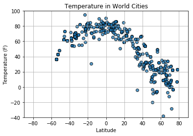
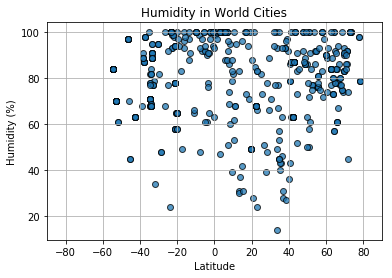
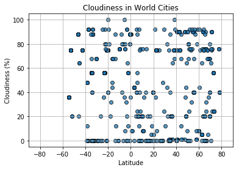
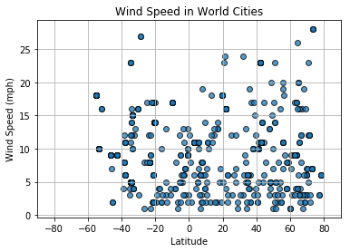

#FINDINGS WeatherPy
1. The average temperature grows increasingly lower as the Latitude moves further from the equator/0 degrees latitude.
2. The range of humidity appears to decrease as the latitude deviates further from equator/0 degrees latitude.
3. The range of possible cloudiness is consistently across all latitudes.
4. The further we move from the equator/0 degrees latitude, the range of windspeed will grow increasingly larger.


```python
# Dependencies
import json
import requests as req
import numpy as np
import pandas as pd
from citipy import citipy
import matplotlib.pyplot as plt
```


```python
nsize = 600
rand_lat = np.random.randint(-90,90,nsize)
rand_lon = np.random.randint(-180,180,nsize)
```


```python
rand_lat = pd.DataFrame(rand_lat)
rand_lon = pd.DataFrame(rand_lon)
df = pd.merge(rand_lat, rand_lon, left_index=True, right_index=True).rename(columns={"0_x":"rand_lat","0_y":"rand_lon"})
df["Nearest City Name"]=""
df["Lat"]=""
df["Lng"]=""
df["Temp"]=""
df["Humidity"]=""
df["Cloudiness"]=""
df["Wind Speed"]=""
df
```


<div>
<style>
    .dataframe thead tr:only-child th {
        text-align: right;
    }

    .dataframe thead th {
        text-align: left;
    }

    .dataframe tbody tr th {
        vertical-align: top;
    }
</style>
<table border="1" class="dataframe">
  <thead>
    <tr style="text-align: right;">
      <th></th>
      <th>rand_lat</th>
      <th>rand_lon</th>
      <th>Nearest City Name</th>
      <th>Lat</th>
      <th>Lng</th>
      <th>Temp</th>
      <th>Humidity</th>
      <th>Cloudiness</th>
      <th>Wind Speed</th>
    </tr>
  </thead>
  <tbody>
    <tr>
      <th>0</th>
      <td>-49</td>
      <td>121</td>
      <td></td>
      <td></td>
      <td></td>
      <td></td>
      <td></td>
      <td></td>
      <td></td>
    </tr>
    <tr>
      <th>1</th>
      <td>-77</td>
      <td>-110</td>
      <td></td>
      <td></td>
      <td></td>
      <td></td>
      <td></td>
      <td></td>
      <td></td>
    </tr>
    <tr>
      <th>2</th>
      <td>14</td>
      <td>157</td>
      <td></td>
      <td></td>
      <td></td>
      <td></td>
      <td></td>
      <td></td>
      <td></td>
    </tr>
    <tr>
      <th>3</th>
      <td>73</td>
      <td>90</td>
      <td></td>
      <td></td>
      <td></td>
      <td></td>
      <td></td>
      <td></td>
      <td></td>
    </tr>
    <tr>
      <th>4</th>
      <td>76</td>
      <td>12</td>
      <td></td>
      <td></td>
      <td></td>
      <td></td>
      <td></td>
      <td></td>
      <td></td>
    </tr>
    <tr>
      <th>5</th>
      <td>-33</td>
      <td>-102</td>
      <td></td>
      <td></td>
      <td></td>
      <td></td>
      <td></td>
      <td></td>
      <td></td>
    </tr>
    <tr>
      <th>6</th>
      <td>-35</td>
      <td>-58</td>
      <td></td>
      <td></td>
      <td></td>
      <td></td>
      <td></td>
      <td></td>
      <td></td>
    </tr>
    <tr>
      <th>7</th>
      <td>-46</td>
      <td>-165</td>
      <td></td>
      <td></td>
      <td></td>
      <td></td>
      <td></td>
      <td></td>
      <td></td>
    </tr>
    <tr>
      <th>8</th>
      <td>-21</td>
      <td>39</td>
      <td></td>
      <td></td>
      <td></td>
      <td></td>
      <td></td>
      <td></td>
      <td></td>
    </tr>
    <tr>
      <th>9</th>
      <td>-45</td>
      <td>-152</td>
      <td></td>
      <td></td>
      <td></td>
      <td></td>
      <td></td>
      <td></td>
      <td></td>
    </tr>
    <tr>
      <th>10</th>
      <td>32</td>
      <td>-160</td>
      <td></td>
      <td></td>
      <td></td>
      <td></td>
      <td></td>
      <td></td>
      <td></td>
    </tr>
    <tr>
      <th>11</th>
      <td>3</td>
      <td>36</td>
      <td></td>
      <td></td>
      <td></td>
      <td></td>
      <td></td>
      <td></td>
      <td></td>
    </tr>
    <tr>
      <th>12</th>
      <td>59</td>
      <td>-179</td>
      <td></td>
      <td></td>
      <td></td>
      <td></td>
      <td></td>
      <td></td>
      <td></td>
    </tr>
    <tr>
      <th>13</th>
      <td>-57</td>
      <td>-14</td>
      <td></td>
      <td></td>
      <td></td>
      <td></td>
      <td></td>
      <td></td>
      <td></td>
    </tr>
    <tr>
      <th>14</th>
      <td>-60</td>
      <td>-38</td>
      <td></td>
      <td></td>
      <td></td>
      <td></td>
      <td></td>
      <td></td>
      <td></td>
    </tr>
    <tr>
      <th>15</th>
      <td>-48</td>
      <td>-24</td>
      <td></td>
      <td></td>
      <td></td>
      <td></td>
      <td></td>
      <td></td>
      <td></td>
    </tr>
    <tr>
      <th>16</th>
      <td>-47</td>
      <td>-129</td>
      <td></td>
      <td></td>
      <td></td>
      <td></td>
      <td></td>
      <td></td>
      <td></td>
    </tr>
    <tr>
      <th>17</th>
      <td>23</td>
      <td>93</td>
      <td></td>
      <td></td>
      <td></td>
      <td></td>
      <td></td>
      <td></td>
      <td></td>
    </tr>
    <tr>
      <th>18</th>
      <td>29</td>
      <td>112</td>
      <td></td>
      <td></td>
      <td></td>
      <td></td>
      <td></td>
      <td></td>
      <td></td>
    </tr>
    <tr>
      <th>19</th>
      <td>12</td>
      <td>-176</td>
      <td></td>
      <td></td>
      <td></td>
      <td></td>
      <td></td>
      <td></td>
      <td></td>
    </tr>
    <tr>
      <th>20</th>
      <td>-48</td>
      <td>93</td>
      <td></td>
      <td></td>
      <td></td>
      <td></td>
      <td></td>
      <td></td>
      <td></td>
    </tr>
    <tr>
      <th>21</th>
      <td>-70</td>
      <td>-121</td>
      <td></td>
      <td></td>
      <td></td>
      <td></td>
      <td></td>
      <td></td>
      <td></td>
    </tr>
    <tr>
      <th>22</th>
      <td>-73</td>
      <td>165</td>
      <td></td>
      <td></td>
      <td></td>
      <td></td>
      <td></td>
      <td></td>
      <td></td>
    </tr>
    <tr>
      <th>23</th>
      <td>17</td>
      <td>-100</td>
      <td></td>
      <td></td>
      <td></td>
      <td></td>
      <td></td>
      <td></td>
      <td></td>
    </tr>
    <tr>
      <th>24</th>
      <td>-85</td>
      <td>45</td>
      <td></td>
      <td></td>
      <td></td>
      <td></td>
      <td></td>
      <td></td>
      <td></td>
    </tr>
    <tr>
      <th>25</th>
      <td>34</td>
      <td>-49</td>
      <td></td>
      <td></td>
      <td></td>
      <td></td>
      <td></td>
      <td></td>
      <td></td>
    </tr>
    <tr>
      <th>26</th>
      <td>43</td>
      <td>-19</td>
      <td></td>
      <td></td>
      <td></td>
      <td></td>
      <td></td>
      <td></td>
      <td></td>
    </tr>
    <tr>
      <th>27</th>
      <td>6</td>
      <td>42</td>
      <td></td>
      <td></td>
      <td></td>
      <td></td>
      <td></td>
      <td></td>
      <td></td>
    </tr>
    <tr>
      <th>28</th>
      <td>56</td>
      <td>146</td>
      <td></td>
      <td></td>
      <td></td>
      <td></td>
      <td></td>
      <td></td>
      <td></td>
    </tr>
    <tr>
      <th>29</th>
      <td>79</td>
      <td>39</td>
      <td></td>
      <td></td>
      <td></td>
      <td></td>
      <td></td>
      <td></td>
      <td></td>
    </tr>
    <tr>
      <th>...</th>
      <td>...</td>
      <td>...</td>
      <td>...</td>
      <td>...</td>
      <td>...</td>
      <td>...</td>
      <td>...</td>
      <td>...</td>
      <td>...</td>
    </tr>
    <tr>
      <th>570</th>
      <td>-59</td>
      <td>153</td>
      <td></td>
      <td></td>
      <td></td>
      <td></td>
      <td></td>
      <td></td>
      <td></td>
    </tr>
    <tr>
      <th>571</th>
      <td>54</td>
      <td>96</td>
      <td></td>
      <td></td>
      <td></td>
      <td></td>
      <td></td>
      <td></td>
      <td></td>
    </tr>
    <tr>
      <th>572</th>
      <td>-51</td>
      <td>-63</td>
      <td></td>
      <td></td>
      <td></td>
      <td></td>
      <td></td>
      <td></td>
      <td></td>
    </tr>
    <tr>
      <th>573</th>
      <td>-59</td>
      <td>-176</td>
      <td></td>
      <td></td>
      <td></td>
      <td></td>
      <td></td>
      <td></td>
      <td></td>
    </tr>
    <tr>
      <th>574</th>
      <td>-41</td>
      <td>131</td>
      <td></td>
      <td></td>
      <td></td>
      <td></td>
      <td></td>
      <td></td>
      <td></td>
    </tr>
    <tr>
      <th>575</th>
      <td>56</td>
      <td>-24</td>
      <td></td>
      <td></td>
      <td></td>
      <td></td>
      <td></td>
      <td></td>
      <td></td>
    </tr>
    <tr>
      <th>576</th>
      <td>-40</td>
      <td>127</td>
      <td></td>
      <td></td>
      <td></td>
      <td></td>
      <td></td>
      <td></td>
      <td></td>
    </tr>
    <tr>
      <th>577</th>
      <td>-53</td>
      <td>168</td>
      <td></td>
      <td></td>
      <td></td>
      <td></td>
      <td></td>
      <td></td>
      <td></td>
    </tr>
    <tr>
      <th>578</th>
      <td>22</td>
      <td>167</td>
      <td></td>
      <td></td>
      <td></td>
      <td></td>
      <td></td>
      <td></td>
      <td></td>
    </tr>
    <tr>
      <th>579</th>
      <td>-59</td>
      <td>142</td>
      <td></td>
      <td></td>
      <td></td>
      <td></td>
      <td></td>
      <td></td>
      <td></td>
    </tr>
    <tr>
      <th>580</th>
      <td>-65</td>
      <td>-81</td>
      <td></td>
      <td></td>
      <td></td>
      <td></td>
      <td></td>
      <td></td>
      <td></td>
    </tr>
    <tr>
      <th>581</th>
      <td>48</td>
      <td>101</td>
      <td></td>
      <td></td>
      <td></td>
      <td></td>
      <td></td>
      <td></td>
      <td></td>
    </tr>
    <tr>
      <th>582</th>
      <td>14</td>
      <td>-7</td>
      <td></td>
      <td></td>
      <td></td>
      <td></td>
      <td></td>
      <td></td>
      <td></td>
    </tr>
    <tr>
      <th>583</th>
      <td>-16</td>
      <td>69</td>
      <td></td>
      <td></td>
      <td></td>
      <td></td>
      <td></td>
      <td></td>
      <td></td>
    </tr>
    <tr>
      <th>584</th>
      <td>-49</td>
      <td>40</td>
      <td></td>
      <td></td>
      <td></td>
      <td></td>
      <td></td>
      <td></td>
      <td></td>
    </tr>
    <tr>
      <th>585</th>
      <td>-35</td>
      <td>-66</td>
      <td></td>
      <td></td>
      <td></td>
      <td></td>
      <td></td>
      <td></td>
      <td></td>
    </tr>
    <tr>
      <th>586</th>
      <td>-20</td>
      <td>-153</td>
      <td></td>
      <td></td>
      <td></td>
      <td></td>
      <td></td>
      <td></td>
      <td></td>
    </tr>
    <tr>
      <th>587</th>
      <td>85</td>
      <td>-116</td>
      <td></td>
      <td></td>
      <td></td>
      <td></td>
      <td></td>
      <td></td>
      <td></td>
    </tr>
    <tr>
      <th>588</th>
      <td>25</td>
      <td>16</td>
      <td></td>
      <td></td>
      <td></td>
      <td></td>
      <td></td>
      <td></td>
      <td></td>
    </tr>
    <tr>
      <th>589</th>
      <td>-5</td>
      <td>24</td>
      <td></td>
      <td></td>
      <td></td>
      <td></td>
      <td></td>
      <td></td>
      <td></td>
    </tr>
    <tr>
      <th>590</th>
      <td>75</td>
      <td>-52</td>
      <td></td>
      <td></td>
      <td></td>
      <td></td>
      <td></td>
      <td></td>
      <td></td>
    </tr>
    <tr>
      <th>591</th>
      <td>-50</td>
      <td>-101</td>
      <td></td>
      <td></td>
      <td></td>
      <td></td>
      <td></td>
      <td></td>
      <td></td>
    </tr>
    <tr>
      <th>592</th>
      <td>6</td>
      <td>75</td>
      <td></td>
      <td></td>
      <td></td>
      <td></td>
      <td></td>
      <td></td>
      <td></td>
    </tr>
    <tr>
      <th>593</th>
      <td>38</td>
      <td>174</td>
      <td></td>
      <td></td>
      <td></td>
      <td></td>
      <td></td>
      <td></td>
      <td></td>
    </tr>
    <tr>
      <th>594</th>
      <td>-68</td>
      <td>107</td>
      <td></td>
      <td></td>
      <td></td>
      <td></td>
      <td></td>
      <td></td>
      <td></td>
    </tr>
    <tr>
      <th>595</th>
      <td>-60</td>
      <td>-5</td>
      <td></td>
      <td></td>
      <td></td>
      <td></td>
      <td></td>
      <td></td>
      <td></td>
    </tr>
    <tr>
      <th>596</th>
      <td>-40</td>
      <td>-137</td>
      <td></td>
      <td></td>
      <td></td>
      <td></td>
      <td></td>
      <td></td>
      <td></td>
    </tr>
    <tr>
      <th>597</th>
      <td>-52</td>
      <td>-11</td>
      <td></td>
      <td></td>
      <td></td>
      <td></td>
      <td></td>
      <td></td>
      <td></td>
    </tr>
    <tr>
      <th>598</th>
      <td>80</td>
      <td>-113</td>
      <td></td>
      <td></td>
      <td></td>
      <td></td>
      <td></td>
      <td></td>
      <td></td>
    </tr>
    <tr>
      <th>599</th>
      <td>-83</td>
      <td>-66</td>
      <td></td>
      <td></td>
      <td></td>
      <td></td>
      <td></td>
      <td></td>
      <td></td>
    </tr>
  </tbody>
</table>
<p>600 rows × 9 columns</p>
</div>


```python
wkey="de3fcedb79e64a4fb54ee874c369145d"

for index, row in df.iterrows():
    city = citipy.nearest_city(row["rand_lat"], row["rand_lon"])
    df.set_value(index,"Nearest City Name", city.city_name)
    print(".", end="")

for index, row in df.iterrows():
    try:
        target_url = "http://api.openweathermap.org/data/2.5/weather?appid=%s&q=%s&units=imperial" % (wkey, row["Nearest City Name"].replace(" ","+"))
        weather = req.get(target_url).json()
        df.set_value(index, "Temp", weather["main"]["temp"])
        df.set_value(index, "Humidity", weather["main"]["humidity"])
        df.set_value(index, "Cloudiness", weather["clouds"]["all"])
        df.set_value(index, "Wind Speed", weather["wind"]["speed"])
        df.set_value(index, "Lat", weather["coord"]["lat"])
        df.set_value(index, "Lng", weather["coord"]["lon"])
        print(index,target_url)
    except:
        print("Missing field...skipping.")
        df = df.drop([index]) #removes cities that cannot be processed or recognized 
df = df.drop(['rand_lat', 'rand_lon'], axis=1).reset_index(drop=True)
df.head(100)

```

    ........................................................................................................................................................................................................................................................................................................................................................................................................................................................................................................................................................................................................................0 http://api.openweathermap.org/data/2.5/weather?appid=de3fcedb79e64a4fb54ee874c369145d&q=albany&units=imperial
    1 http://api.openweathermap.org/data/2.5/weather?appid=de3fcedb79e64a4fb54ee874c369145d&q=punta+arenas&units=imperial
    2 http://api.openweathermap.org/data/2.5/weather?appid=de3fcedb79e64a4fb54ee874c369145d&q=kavieng&units=imperial
    3 http://api.openweathermap.org/data/2.5/weather?appid=de3fcedb79e64a4fb54ee874c369145d&q=talnakh&units=imperial
    Missing field...skipping.
    5 http://api.openweathermap.org/data/2.5/weather?appid=de3fcedb79e64a4fb54ee874c369145d&q=lebu&units=imperial
    6 http://api.openweathermap.org/data/2.5/weather?appid=de3fcedb79e64a4fb54ee874c369145d&q=la+plata&units=imperial
    7 http://api.openweathermap.org/data/2.5/weather?appid=de3fcedb79e64a4fb54ee874c369145d&q=avarua&units=imperial
    8 http://api.openweathermap.org/data/2.5/weather?appid=de3fcedb79e64a4fb54ee874c369145d&q=quelimane&units=imperial
    Missing field...skipping.
    10 http://api.openweathermap.org/data/2.5/weather?appid=de3fcedb79e64a4fb54ee874c369145d&q=kapaa&units=imperial
    11 http://api.openweathermap.org/data/2.5/weather?appid=de3fcedb79e64a4fb54ee874c369145d&q=lodwar&units=imperial
    12 http://api.openweathermap.org/data/2.5/weather?appid=de3fcedb79e64a4fb54ee874c369145d&q=egvekinot&units=imperial
    13 http://api.openweathermap.org/data/2.5/weather?appid=de3fcedb79e64a4fb54ee874c369145d&q=cape+town&units=imperial
    14 http://api.openweathermap.org/data/2.5/weather?appid=de3fcedb79e64a4fb54ee874c369145d&q=mar+del+plata&units=imperial
    15 http://api.openweathermap.org/data/2.5/weather?appid=de3fcedb79e64a4fb54ee874c369145d&q=arraial+do+cabo&units=imperial
    16 http://api.openweathermap.org/data/2.5/weather?appid=de3fcedb79e64a4fb54ee874c369145d&q=rikitea&units=imperial
    17 http://api.openweathermap.org/data/2.5/weather?appid=de3fcedb79e64a4fb54ee874c369145d&q=north+vanlaiphai&units=imperial
    18 http://api.openweathermap.org/data/2.5/weather?appid=de3fcedb79e64a4fb54ee874c369145d&q=changde&units=imperial
    19 http://api.openweathermap.org/data/2.5/weather?appid=de3fcedb79e64a4fb54ee874c369145d&q=kapaa&units=imperial
    20 http://api.openweathermap.org/data/2.5/weather?appid=de3fcedb79e64a4fb54ee874c369145d&q=busselton&units=imperial
    21 http://api.openweathermap.org/data/2.5/weather?appid=de3fcedb79e64a4fb54ee874c369145d&q=rikitea&units=imperial
    22 http://api.openweathermap.org/data/2.5/weather?appid=de3fcedb79e64a4fb54ee874c369145d&q=bluff&units=imperial
    Missing field...skipping.
    24 http://api.openweathermap.org/data/2.5/weather?appid=de3fcedb79e64a4fb54ee874c369145d&q=port+alfred&units=imperial
    25 http://api.openweathermap.org/data/2.5/weather?appid=de3fcedb79e64a4fb54ee874c369145d&q=torbay&units=imperial
    26 http://api.openweathermap.org/data/2.5/weather?appid=de3fcedb79e64a4fb54ee874c369145d&q=vila+franca+do+campo&units=imperial
    27 http://api.openweathermap.org/data/2.5/weather?appid=de3fcedb79e64a4fb54ee874c369145d&q=ginir&units=imperial
    28 http://api.openweathermap.org/data/2.5/weather?appid=de3fcedb79e64a4fb54ee874c369145d&q=okha&units=imperial
    Missing field...skipping.
    30 http://api.openweathermap.org/data/2.5/weather?appid=de3fcedb79e64a4fb54ee874c369145d&q=ushuaia&units=imperial
    31 http://api.openweathermap.org/data/2.5/weather?appid=de3fcedb79e64a4fb54ee874c369145d&q=tahoua&units=imperial
    32 http://api.openweathermap.org/data/2.5/weather?appid=de3fcedb79e64a4fb54ee874c369145d&q=kodiak&units=imperial
    Missing field...skipping.
    34 http://api.openweathermap.org/data/2.5/weather?appid=de3fcedb79e64a4fb54ee874c369145d&q=trincomalee&units=imperial
    35 http://api.openweathermap.org/data/2.5/weather?appid=de3fcedb79e64a4fb54ee874c369145d&q=rikitea&units=imperial
    36 http://api.openweathermap.org/data/2.5/weather?appid=de3fcedb79e64a4fb54ee874c369145d&q=deputatskiy&units=imperial
    37 http://api.openweathermap.org/data/2.5/weather?appid=de3fcedb79e64a4fb54ee874c369145d&q=east+london&units=imperial
    38 http://api.openweathermap.org/data/2.5/weather?appid=de3fcedb79e64a4fb54ee874c369145d&q=dunedin&units=imperial
    Missing field...skipping.
    40 http://api.openweathermap.org/data/2.5/weather?appid=de3fcedb79e64a4fb54ee874c369145d&q=kruisfontein&units=imperial
    Missing field...skipping.
    Missing field...skipping.
    43 http://api.openweathermap.org/data/2.5/weather?appid=de3fcedb79e64a4fb54ee874c369145d&q=norman+wells&units=imperial
    Missing field...skipping.
    45 http://api.openweathermap.org/data/2.5/weather?appid=de3fcedb79e64a4fb54ee874c369145d&q=saint-philippe&units=imperial
    46 http://api.openweathermap.org/data/2.5/weather?appid=de3fcedb79e64a4fb54ee874c369145d&q=jamestown&units=imperial
    47 http://api.openweathermap.org/data/2.5/weather?appid=de3fcedb79e64a4fb54ee874c369145d&q=bluff&units=imperial
    48 http://api.openweathermap.org/data/2.5/weather?appid=de3fcedb79e64a4fb54ee874c369145d&q=desaguadero&units=imperial
    49 http://api.openweathermap.org/data/2.5/weather?appid=de3fcedb79e64a4fb54ee874c369145d&q=hamilton&units=imperial
    50 http://api.openweathermap.org/data/2.5/weather?appid=de3fcedb79e64a4fb54ee874c369145d&q=severo-kurilsk&units=imperial
    Missing field...skipping.
    52 http://api.openweathermap.org/data/2.5/weather?appid=de3fcedb79e64a4fb54ee874c369145d&q=nouadhibou&units=imperial
    53 http://api.openweathermap.org/data/2.5/weather?appid=de3fcedb79e64a4fb54ee874c369145d&q=carnarvon&units=imperial
    54 http://api.openweathermap.org/data/2.5/weather?appid=de3fcedb79e64a4fb54ee874c369145d&q=kodiak&units=imperial
    55 http://api.openweathermap.org/data/2.5/weather?appid=de3fcedb79e64a4fb54ee874c369145d&q=hermanus&units=imperial
    56 http://api.openweathermap.org/data/2.5/weather?appid=de3fcedb79e64a4fb54ee874c369145d&q=vaini&units=imperial
    57 http://api.openweathermap.org/data/2.5/weather?appid=de3fcedb79e64a4fb54ee874c369145d&q=cockburn+town&units=imperial
    58 http://api.openweathermap.org/data/2.5/weather?appid=de3fcedb79e64a4fb54ee874c369145d&q=salinopolis&units=imperial
    Missing field...skipping.
    60 http://api.openweathermap.org/data/2.5/weather?appid=de3fcedb79e64a4fb54ee874c369145d&q=ushuaia&units=imperial
    Missing field...skipping.
    62 http://api.openweathermap.org/data/2.5/weather?appid=de3fcedb79e64a4fb54ee874c369145d&q=phuket&units=imperial
    63 http://api.openweathermap.org/data/2.5/weather?appid=de3fcedb79e64a4fb54ee874c369145d&q=tura&units=imperial
    64 http://api.openweathermap.org/data/2.5/weather?appid=de3fcedb79e64a4fb54ee874c369145d&q=tasiilaq&units=imperial
    65 http://api.openweathermap.org/data/2.5/weather?appid=de3fcedb79e64a4fb54ee874c369145d&q=poum&units=imperial
    Missing field...skipping.
    67 http://api.openweathermap.org/data/2.5/weather?appid=de3fcedb79e64a4fb54ee874c369145d&q=touros&units=imperial
    68 http://api.openweathermap.org/data/2.5/weather?appid=de3fcedb79e64a4fb54ee874c369145d&q=hobart&units=imperial
    Missing field...skipping.
    70 http://api.openweathermap.org/data/2.5/weather?appid=de3fcedb79e64a4fb54ee874c369145d&q=bluff&units=imperial
    71 http://api.openweathermap.org/data/2.5/weather?appid=de3fcedb79e64a4fb54ee874c369145d&q=boguchany&units=imperial
    72 http://api.openweathermap.org/data/2.5/weather?appid=de3fcedb79e64a4fb54ee874c369145d&q=tornio&units=imperial
    Missing field...skipping.
    74 http://api.openweathermap.org/data/2.5/weather?appid=de3fcedb79e64a4fb54ee874c369145d&q=barrow&units=imperial
    75 http://api.openweathermap.org/data/2.5/weather?appid=de3fcedb79e64a4fb54ee874c369145d&q=rikitea&units=imperial
    76 http://api.openweathermap.org/data/2.5/weather?appid=de3fcedb79e64a4fb54ee874c369145d&q=bridgewater&units=imperial
    77 http://api.openweathermap.org/data/2.5/weather?appid=de3fcedb79e64a4fb54ee874c369145d&q=morris&units=imperial
    78 http://api.openweathermap.org/data/2.5/weather?appid=de3fcedb79e64a4fb54ee874c369145d&q=susanville&units=imperial
    79 http://api.openweathermap.org/data/2.5/weather?appid=de3fcedb79e64a4fb54ee874c369145d&q=tuapse&units=imperial
    80 http://api.openweathermap.org/data/2.5/weather?appid=de3fcedb79e64a4fb54ee874c369145d&q=sinnamary&units=imperial
    81 http://api.openweathermap.org/data/2.5/weather?appid=de3fcedb79e64a4fb54ee874c369145d&q=caconda&units=imperial
    82 http://api.openweathermap.org/data/2.5/weather?appid=de3fcedb79e64a4fb54ee874c369145d&q=nanortalik&units=imperial
    83 http://api.openweathermap.org/data/2.5/weather?appid=de3fcedb79e64a4fb54ee874c369145d&q=dikson&units=imperial
    Missing field...skipping.
    85 http://api.openweathermap.org/data/2.5/weather?appid=de3fcedb79e64a4fb54ee874c369145d&q=avarua&units=imperial
    86 http://api.openweathermap.org/data/2.5/weather?appid=de3fcedb79e64a4fb54ee874c369145d&q=prince+albert&units=imperial
    Missing field...skipping.
    88 http://api.openweathermap.org/data/2.5/weather?appid=de3fcedb79e64a4fb54ee874c369145d&q=leh&units=imperial
    89 http://api.openweathermap.org/data/2.5/weather?appid=de3fcedb79e64a4fb54ee874c369145d&q=bonthe&units=imperial
    Missing field...skipping.
    91 http://api.openweathermap.org/data/2.5/weather?appid=de3fcedb79e64a4fb54ee874c369145d&q=dingle&units=imperial
    92 http://api.openweathermap.org/data/2.5/weather?appid=de3fcedb79e64a4fb54ee874c369145d&q=komsomolskiy&units=imperial
    93 http://api.openweathermap.org/data/2.5/weather?appid=de3fcedb79e64a4fb54ee874c369145d&q=buala&units=imperial
    94 http://api.openweathermap.org/data/2.5/weather?appid=de3fcedb79e64a4fb54ee874c369145d&q=punta+arenas&units=imperial
    95 http://api.openweathermap.org/data/2.5/weather?appid=de3fcedb79e64a4fb54ee874c369145d&q=smithers&units=imperial
    96 http://api.openweathermap.org/data/2.5/weather?appid=de3fcedb79e64a4fb54ee874c369145d&q=shubarshi&units=imperial
    97 http://api.openweathermap.org/data/2.5/weather?appid=de3fcedb79e64a4fb54ee874c369145d&q=port+alfred&units=imperial
    98 http://api.openweathermap.org/data/2.5/weather?appid=de3fcedb79e64a4fb54ee874c369145d&q=port+elizabeth&units=imperial
    Missing field...skipping.
    100 http://api.openweathermap.org/data/2.5/weather?appid=de3fcedb79e64a4fb54ee874c369145d&q=albany&units=imperial
    101 http://api.openweathermap.org/data/2.5/weather?appid=de3fcedb79e64a4fb54ee874c369145d&q=bikaner&units=imperial
    102 http://api.openweathermap.org/data/2.5/weather?appid=de3fcedb79e64a4fb54ee874c369145d&q=finschhafen&units=imperial
    103 http://api.openweathermap.org/data/2.5/weather?appid=de3fcedb79e64a4fb54ee874c369145d&q=victoria&units=imperial
    104 http://api.openweathermap.org/data/2.5/weather?appid=de3fcedb79e64a4fb54ee874c369145d&q=albany&units=imperial
    Missing field...skipping.
    106 http://api.openweathermap.org/data/2.5/weather?appid=de3fcedb79e64a4fb54ee874c369145d&q=havoysund&units=imperial
    107 http://api.openweathermap.org/data/2.5/weather?appid=de3fcedb79e64a4fb54ee874c369145d&q=nizwa&units=imperial
    108 http://api.openweathermap.org/data/2.5/weather?appid=de3fcedb79e64a4fb54ee874c369145d&q=rikitea&units=imperial
    109 http://api.openweathermap.org/data/2.5/weather?appid=de3fcedb79e64a4fb54ee874c369145d&q=yar-sale&units=imperial
    110 http://api.openweathermap.org/data/2.5/weather?appid=de3fcedb79e64a4fb54ee874c369145d&q=cherskiy&units=imperial
    Missing field...skipping.
    Missing field...skipping.
    113 http://api.openweathermap.org/data/2.5/weather?appid=de3fcedb79e64a4fb54ee874c369145d&q=ushuaia&units=imperial
    114 http://api.openweathermap.org/data/2.5/weather?appid=de3fcedb79e64a4fb54ee874c369145d&q=kamenka&units=imperial
    Missing field...skipping.
    Missing field...skipping.
    117 http://api.openweathermap.org/data/2.5/weather?appid=de3fcedb79e64a4fb54ee874c369145d&q=lebu&units=imperial
    118 http://api.openweathermap.org/data/2.5/weather?appid=de3fcedb79e64a4fb54ee874c369145d&q=yellowknife&units=imperial
    119 http://api.openweathermap.org/data/2.5/weather?appid=de3fcedb79e64a4fb54ee874c369145d&q=butaritari&units=imperial
    120 http://api.openweathermap.org/data/2.5/weather?appid=de3fcedb79e64a4fb54ee874c369145d&q=springdale&units=imperial
    121 http://api.openweathermap.org/data/2.5/weather?appid=de3fcedb79e64a4fb54ee874c369145d&q=sao+felix+do+xingu&units=imperial
    122 http://api.openweathermap.org/data/2.5/weather?appid=de3fcedb79e64a4fb54ee874c369145d&q=hoyanger&units=imperial
    123 http://api.openweathermap.org/data/2.5/weather?appid=de3fcedb79e64a4fb54ee874c369145d&q=walvis+bay&units=imperial
    124 http://api.openweathermap.org/data/2.5/weather?appid=de3fcedb79e64a4fb54ee874c369145d&q=coquimbo&units=imperial
    125 http://api.openweathermap.org/data/2.5/weather?appid=de3fcedb79e64a4fb54ee874c369145d&q=la+ronge&units=imperial
    126 http://api.openweathermap.org/data/2.5/weather?appid=de3fcedb79e64a4fb54ee874c369145d&q=barrow&units=imperial
    127 http://api.openweathermap.org/data/2.5/weather?appid=de3fcedb79e64a4fb54ee874c369145d&q=hithadhoo&units=imperial
    Missing field...skipping.
    129 http://api.openweathermap.org/data/2.5/weather?appid=de3fcedb79e64a4fb54ee874c369145d&q=hamilton&units=imperial
    130 http://api.openweathermap.org/data/2.5/weather?appid=de3fcedb79e64a4fb54ee874c369145d&q=chukhloma&units=imperial
    131 http://api.openweathermap.org/data/2.5/weather?appid=de3fcedb79e64a4fb54ee874c369145d&q=thompson&units=imperial
    132 http://api.openweathermap.org/data/2.5/weather?appid=de3fcedb79e64a4fb54ee874c369145d&q=ushuaia&units=imperial
    133 http://api.openweathermap.org/data/2.5/weather?appid=de3fcedb79e64a4fb54ee874c369145d&q=yellowknife&units=imperial
    134 http://api.openweathermap.org/data/2.5/weather?appid=de3fcedb79e64a4fb54ee874c369145d&q=atuona&units=imperial
    135 http://api.openweathermap.org/data/2.5/weather?appid=de3fcedb79e64a4fb54ee874c369145d&q=bredasdorp&units=imperial
    136 http://api.openweathermap.org/data/2.5/weather?appid=de3fcedb79e64a4fb54ee874c369145d&q=el+alto&units=imperial
    137 http://api.openweathermap.org/data/2.5/weather?appid=de3fcedb79e64a4fb54ee874c369145d&q=ushuaia&units=imperial
    138 http://api.openweathermap.org/data/2.5/weather?appid=de3fcedb79e64a4fb54ee874c369145d&q=ipora&units=imperial
    139 http://api.openweathermap.org/data/2.5/weather?appid=de3fcedb79e64a4fb54ee874c369145d&q=alice+springs&units=imperial
    Missing field...skipping.
    141 http://api.openweathermap.org/data/2.5/weather?appid=de3fcedb79e64a4fb54ee874c369145d&q=torbay&units=imperial
    142 http://api.openweathermap.org/data/2.5/weather?appid=de3fcedb79e64a4fb54ee874c369145d&q=tymovskoye&units=imperial
    143 http://api.openweathermap.org/data/2.5/weather?appid=de3fcedb79e64a4fb54ee874c369145d&q=sahuaripa&units=imperial
    144 http://api.openweathermap.org/data/2.5/weather?appid=de3fcedb79e64a4fb54ee874c369145d&q=geraldton&units=imperial
    145 http://api.openweathermap.org/data/2.5/weather?appid=de3fcedb79e64a4fb54ee874c369145d&q=vaini&units=imperial
    146 http://api.openweathermap.org/data/2.5/weather?appid=de3fcedb79e64a4fb54ee874c369145d&q=grand+gaube&units=imperial
    147 http://api.openweathermap.org/data/2.5/weather?appid=de3fcedb79e64a4fb54ee874c369145d&q=ushuaia&units=imperial
    Missing field...skipping.
    Missing field...skipping.
    150 http://api.openweathermap.org/data/2.5/weather?appid=de3fcedb79e64a4fb54ee874c369145d&q=sao+miguel+do+araguaia&units=imperial
    151 http://api.openweathermap.org/data/2.5/weather?appid=de3fcedb79e64a4fb54ee874c369145d&q=glasgow&units=imperial
    152 http://api.openweathermap.org/data/2.5/weather?appid=de3fcedb79e64a4fb54ee874c369145d&q=manzhouli&units=imperial
    153 http://api.openweathermap.org/data/2.5/weather?appid=de3fcedb79e64a4fb54ee874c369145d&q=chuy&units=imperial
    Missing field...skipping.
    155 http://api.openweathermap.org/data/2.5/weather?appid=de3fcedb79e64a4fb54ee874c369145d&q=longyearbyen&units=imperial
    156 http://api.openweathermap.org/data/2.5/weather?appid=de3fcedb79e64a4fb54ee874c369145d&q=rikitea&units=imperial
    157 http://api.openweathermap.org/data/2.5/weather?appid=de3fcedb79e64a4fb54ee874c369145d&q=iqaluit&units=imperial
    158 http://api.openweathermap.org/data/2.5/weather?appid=de3fcedb79e64a4fb54ee874c369145d&q=rikitea&units=imperial
    159 http://api.openweathermap.org/data/2.5/weather?appid=de3fcedb79e64a4fb54ee874c369145d&q=ushuaia&units=imperial
    160 http://api.openweathermap.org/data/2.5/weather?appid=de3fcedb79e64a4fb54ee874c369145d&q=trenggalek&units=imperial
    161 http://api.openweathermap.org/data/2.5/weather?appid=de3fcedb79e64a4fb54ee874c369145d&q=nanortalik&units=imperial
    162 http://api.openweathermap.org/data/2.5/weather?appid=de3fcedb79e64a4fb54ee874c369145d&q=rikitea&units=imperial
    163 http://api.openweathermap.org/data/2.5/weather?appid=de3fcedb79e64a4fb54ee874c369145d&q=butaritari&units=imperial
    164 http://api.openweathermap.org/data/2.5/weather?appid=de3fcedb79e64a4fb54ee874c369145d&q=hilo&units=imperial
    165 http://api.openweathermap.org/data/2.5/weather?appid=de3fcedb79e64a4fb54ee874c369145d&q=tuktoyaktuk&units=imperial
    166 http://api.openweathermap.org/data/2.5/weather?appid=de3fcedb79e64a4fb54ee874c369145d&q=cayenne&units=imperial
    167 http://api.openweathermap.org/data/2.5/weather?appid=de3fcedb79e64a4fb54ee874c369145d&q=upernavik&units=imperial
    Missing field...skipping.
    169 http://api.openweathermap.org/data/2.5/weather?appid=de3fcedb79e64a4fb54ee874c369145d&q=broken+hill&units=imperial
    Missing field...skipping.
    171 http://api.openweathermap.org/data/2.5/weather?appid=de3fcedb79e64a4fb54ee874c369145d&q=anadyr&units=imperial
    Missing field...skipping.
    173 http://api.openweathermap.org/data/2.5/weather?appid=de3fcedb79e64a4fb54ee874c369145d&q=cherskiy&units=imperial
    174 http://api.openweathermap.org/data/2.5/weather?appid=de3fcedb79e64a4fb54ee874c369145d&q=vaini&units=imperial
    175 http://api.openweathermap.org/data/2.5/weather?appid=de3fcedb79e64a4fb54ee874c369145d&q=albany&units=imperial
    176 http://api.openweathermap.org/data/2.5/weather?appid=de3fcedb79e64a4fb54ee874c369145d&q=mar+del+plata&units=imperial
    177 http://api.openweathermap.org/data/2.5/weather?appid=de3fcedb79e64a4fb54ee874c369145d&q=salalah&units=imperial
    178 http://api.openweathermap.org/data/2.5/weather?appid=de3fcedb79e64a4fb54ee874c369145d&q=bredasdorp&units=imperial
    179 http://api.openweathermap.org/data/2.5/weather?appid=de3fcedb79e64a4fb54ee874c369145d&q=te+anau&units=imperial
    180 http://api.openweathermap.org/data/2.5/weather?appid=de3fcedb79e64a4fb54ee874c369145d&q=hermanus&units=imperial
    181 http://api.openweathermap.org/data/2.5/weather?appid=de3fcedb79e64a4fb54ee874c369145d&q=thompson&units=imperial
    182 http://api.openweathermap.org/data/2.5/weather?appid=de3fcedb79e64a4fb54ee874c369145d&q=livingston&units=imperial
    183 http://api.openweathermap.org/data/2.5/weather?appid=de3fcedb79e64a4fb54ee874c369145d&q=busselton&units=imperial
    184 http://api.openweathermap.org/data/2.5/weather?appid=de3fcedb79e64a4fb54ee874c369145d&q=thompson&units=imperial
    185 http://api.openweathermap.org/data/2.5/weather?appid=de3fcedb79e64a4fb54ee874c369145d&q=ushuaia&units=imperial
    186 http://api.openweathermap.org/data/2.5/weather?appid=de3fcedb79e64a4fb54ee874c369145d&q=hermanus&units=imperial
    187 http://api.openweathermap.org/data/2.5/weather?appid=de3fcedb79e64a4fb54ee874c369145d&q=albany&units=imperial
    188 http://api.openweathermap.org/data/2.5/weather?appid=de3fcedb79e64a4fb54ee874c369145d&q=bathsheba&units=imperial
    189 http://api.openweathermap.org/data/2.5/weather?appid=de3fcedb79e64a4fb54ee874c369145d&q=kutahya&units=imperial
    Missing field...skipping.
    191 http://api.openweathermap.org/data/2.5/weather?appid=de3fcedb79e64a4fb54ee874c369145d&q=banda+aceh&units=imperial
    Missing field...skipping.
    193 http://api.openweathermap.org/data/2.5/weather?appid=de3fcedb79e64a4fb54ee874c369145d&q=souillac&units=imperial
    194 http://api.openweathermap.org/data/2.5/weather?appid=de3fcedb79e64a4fb54ee874c369145d&q=hermanus&units=imperial
    195 http://api.openweathermap.org/data/2.5/weather?appid=de3fcedb79e64a4fb54ee874c369145d&q=cape+town&units=imperial
    196 http://api.openweathermap.org/data/2.5/weather?appid=de3fcedb79e64a4fb54ee874c369145d&q=vaini&units=imperial
    197 http://api.openweathermap.org/data/2.5/weather?appid=de3fcedb79e64a4fb54ee874c369145d&q=jamestown&units=imperial
    Missing field...skipping.
    199 http://api.openweathermap.org/data/2.5/weather?appid=de3fcedb79e64a4fb54ee874c369145d&q=orlik&units=imperial
    Missing field...skipping.
    Missing field...skipping.
    202 http://api.openweathermap.org/data/2.5/weather?appid=de3fcedb79e64a4fb54ee874c369145d&q=paracuru&units=imperial
    203 http://api.openweathermap.org/data/2.5/weather?appid=de3fcedb79e64a4fb54ee874c369145d&q=saint-philippe&units=imperial
    204 http://api.openweathermap.org/data/2.5/weather?appid=de3fcedb79e64a4fb54ee874c369145d&q=young&units=imperial
    205 http://api.openweathermap.org/data/2.5/weather?appid=de3fcedb79e64a4fb54ee874c369145d&q=cape+town&units=imperial
    206 http://api.openweathermap.org/data/2.5/weather?appid=de3fcedb79e64a4fb54ee874c369145d&q=hithadhoo&units=imperial
    207 http://api.openweathermap.org/data/2.5/weather?appid=de3fcedb79e64a4fb54ee874c369145d&q=provideniya&units=imperial
    Missing field...skipping.
    209 http://api.openweathermap.org/data/2.5/weather?appid=de3fcedb79e64a4fb54ee874c369145d&q=punta+arenas&units=imperial
    210 http://api.openweathermap.org/data/2.5/weather?appid=de3fcedb79e64a4fb54ee874c369145d&q=mahebourg&units=imperial
    211 http://api.openweathermap.org/data/2.5/weather?appid=de3fcedb79e64a4fb54ee874c369145d&q=casablanca&units=imperial
    212 http://api.openweathermap.org/data/2.5/weather?appid=de3fcedb79e64a4fb54ee874c369145d&q=kontagora&units=imperial
    213 http://api.openweathermap.org/data/2.5/weather?appid=de3fcedb79e64a4fb54ee874c369145d&q=nangomba&units=imperial
    214 http://api.openweathermap.org/data/2.5/weather?appid=de3fcedb79e64a4fb54ee874c369145d&q=samarinda&units=imperial
    215 http://api.openweathermap.org/data/2.5/weather?appid=de3fcedb79e64a4fb54ee874c369145d&q=bethel&units=imperial
    216 http://api.openweathermap.org/data/2.5/weather?appid=de3fcedb79e64a4fb54ee874c369145d&q=shimoda&units=imperial
    217 http://api.openweathermap.org/data/2.5/weather?appid=de3fcedb79e64a4fb54ee874c369145d&q=ushuaia&units=imperial
    218 http://api.openweathermap.org/data/2.5/weather?appid=de3fcedb79e64a4fb54ee874c369145d&q=pevek&units=imperial
    219 http://api.openweathermap.org/data/2.5/weather?appid=de3fcedb79e64a4fb54ee874c369145d&q=hobart&units=imperial
    220 http://api.openweathermap.org/data/2.5/weather?appid=de3fcedb79e64a4fb54ee874c369145d&q=cidreira&units=imperial
    221 http://api.openweathermap.org/data/2.5/weather?appid=de3fcedb79e64a4fb54ee874c369145d&q=saint-philippe&units=imperial
    222 http://api.openweathermap.org/data/2.5/weather?appid=de3fcedb79e64a4fb54ee874c369145d&q=chuy&units=imperial
    223 http://api.openweathermap.org/data/2.5/weather?appid=de3fcedb79e64a4fb54ee874c369145d&q=butaritari&units=imperial
    224 http://api.openweathermap.org/data/2.5/weather?appid=de3fcedb79e64a4fb54ee874c369145d&q=tual&units=imperial
    225 http://api.openweathermap.org/data/2.5/weather?appid=de3fcedb79e64a4fb54ee874c369145d&q=hermanus&units=imperial
    Missing field...skipping.
    Missing field...skipping.
    228 http://api.openweathermap.org/data/2.5/weather?appid=de3fcedb79e64a4fb54ee874c369145d&q=rikitea&units=imperial
    229 http://api.openweathermap.org/data/2.5/weather?appid=de3fcedb79e64a4fb54ee874c369145d&q=guerrero+negro&units=imperial
    230 http://api.openweathermap.org/data/2.5/weather?appid=de3fcedb79e64a4fb54ee874c369145d&q=faanui&units=imperial
    231 http://api.openweathermap.org/data/2.5/weather?appid=de3fcedb79e64a4fb54ee874c369145d&q=bethel&units=imperial
    232 http://api.openweathermap.org/data/2.5/weather?appid=de3fcedb79e64a4fb54ee874c369145d&q=albany&units=imperial
    233 http://api.openweathermap.org/data/2.5/weather?appid=de3fcedb79e64a4fb54ee874c369145d&q=qaanaaq&units=imperial
    Missing field...skipping.
    235 http://api.openweathermap.org/data/2.5/weather?appid=de3fcedb79e64a4fb54ee874c369145d&q=georgetown&units=imperial
    Missing field...skipping.
    237 http://api.openweathermap.org/data/2.5/weather?appid=de3fcedb79e64a4fb54ee874c369145d&q=georgetown&units=imperial
    Missing field...skipping.
    239 http://api.openweathermap.org/data/2.5/weather?appid=de3fcedb79e64a4fb54ee874c369145d&q=guanica&units=imperial
    240 http://api.openweathermap.org/data/2.5/weather?appid=de3fcedb79e64a4fb54ee874c369145d&q=codrington&units=imperial
    241 http://api.openweathermap.org/data/2.5/weather?appid=de3fcedb79e64a4fb54ee874c369145d&q=new+norfolk&units=imperial
    242 http://api.openweathermap.org/data/2.5/weather?appid=de3fcedb79e64a4fb54ee874c369145d&q=chapais&units=imperial
    243 http://api.openweathermap.org/data/2.5/weather?appid=de3fcedb79e64a4fb54ee874c369145d&q=vanavara&units=imperial
    244 http://api.openweathermap.org/data/2.5/weather?appid=de3fcedb79e64a4fb54ee874c369145d&q=thinadhoo&units=imperial
    245 http://api.openweathermap.org/data/2.5/weather?appid=de3fcedb79e64a4fb54ee874c369145d&q=lagoa&units=imperial
    246 http://api.openweathermap.org/data/2.5/weather?appid=de3fcedb79e64a4fb54ee874c369145d&q=lebu&units=imperial
    247 http://api.openweathermap.org/data/2.5/weather?appid=de3fcedb79e64a4fb54ee874c369145d&q=aragarcas&units=imperial
    248 http://api.openweathermap.org/data/2.5/weather?appid=de3fcedb79e64a4fb54ee874c369145d&q=hobart&units=imperial
    249 http://api.openweathermap.org/data/2.5/weather?appid=de3fcedb79e64a4fb54ee874c369145d&q=rikitea&units=imperial
    250 http://api.openweathermap.org/data/2.5/weather?appid=de3fcedb79e64a4fb54ee874c369145d&q=cherepanovo&units=imperial
    251 http://api.openweathermap.org/data/2.5/weather?appid=de3fcedb79e64a4fb54ee874c369145d&q=puerto+ayora&units=imperial
    252 http://api.openweathermap.org/data/2.5/weather?appid=de3fcedb79e64a4fb54ee874c369145d&q=dingle&units=imperial
    253 http://api.openweathermap.org/data/2.5/weather?appid=de3fcedb79e64a4fb54ee874c369145d&q=butaritari&units=imperial
    254 http://api.openweathermap.org/data/2.5/weather?appid=de3fcedb79e64a4fb54ee874c369145d&q=mar+del+plata&units=imperial
    255 http://api.openweathermap.org/data/2.5/weather?appid=de3fcedb79e64a4fb54ee874c369145d&q=saint-pierre&units=imperial
    256 http://api.openweathermap.org/data/2.5/weather?appid=de3fcedb79e64a4fb54ee874c369145d&q=sorland&units=imperial
    257 http://api.openweathermap.org/data/2.5/weather?appid=de3fcedb79e64a4fb54ee874c369145d&q=port+alfred&units=imperial
    Missing field...skipping.
    259 http://api.openweathermap.org/data/2.5/weather?appid=de3fcedb79e64a4fb54ee874c369145d&q=punta+arenas&units=imperial
    260 http://api.openweathermap.org/data/2.5/weather?appid=de3fcedb79e64a4fb54ee874c369145d&q=ushuaia&units=imperial
    261 http://api.openweathermap.org/data/2.5/weather?appid=de3fcedb79e64a4fb54ee874c369145d&q=jamestown&units=imperial
    Missing field...skipping.
    263 http://api.openweathermap.org/data/2.5/weather?appid=de3fcedb79e64a4fb54ee874c369145d&q=nakamura&units=imperial
    Missing field...skipping.
    Missing field...skipping.
    266 http://api.openweathermap.org/data/2.5/weather?appid=de3fcedb79e64a4fb54ee874c369145d&q=cidreira&units=imperial
    267 http://api.openweathermap.org/data/2.5/weather?appid=de3fcedb79e64a4fb54ee874c369145d&q=cidreira&units=imperial
    268 http://api.openweathermap.org/data/2.5/weather?appid=de3fcedb79e64a4fb54ee874c369145d&q=albany&units=imperial
    269 http://api.openweathermap.org/data/2.5/weather?appid=de3fcedb79e64a4fb54ee874c369145d&q=kapaa&units=imperial
    270 http://api.openweathermap.org/data/2.5/weather?appid=de3fcedb79e64a4fb54ee874c369145d&q=kapaa&units=imperial
    271 http://api.openweathermap.org/data/2.5/weather?appid=de3fcedb79e64a4fb54ee874c369145d&q=bartica&units=imperial
    272 http://api.openweathermap.org/data/2.5/weather?appid=de3fcedb79e64a4fb54ee874c369145d&q=busselton&units=imperial
    273 http://api.openweathermap.org/data/2.5/weather?appid=de3fcedb79e64a4fb54ee874c369145d&q=ushuaia&units=imperial
    Missing field...skipping.
    275 http://api.openweathermap.org/data/2.5/weather?appid=de3fcedb79e64a4fb54ee874c369145d&q=longyearbyen&units=imperial
    276 http://api.openweathermap.org/data/2.5/weather?appid=de3fcedb79e64a4fb54ee874c369145d&q=tecoanapa&units=imperial
    277 http://api.openweathermap.org/data/2.5/weather?appid=de3fcedb79e64a4fb54ee874c369145d&q=saint+george&units=imperial
    Missing field...skipping.
    Missing field...skipping.
    280 http://api.openweathermap.org/data/2.5/weather?appid=de3fcedb79e64a4fb54ee874c369145d&q=katsuura&units=imperial
    281 http://api.openweathermap.org/data/2.5/weather?appid=de3fcedb79e64a4fb54ee874c369145d&q=leningradskiy&units=imperial
    282 http://api.openweathermap.org/data/2.5/weather?appid=de3fcedb79e64a4fb54ee874c369145d&q=crib+point&units=imperial
    283 http://api.openweathermap.org/data/2.5/weather?appid=de3fcedb79e64a4fb54ee874c369145d&q=esperance&units=imperial
    284 http://api.openweathermap.org/data/2.5/weather?appid=de3fcedb79e64a4fb54ee874c369145d&q=bentiu&units=imperial
    285 http://api.openweathermap.org/data/2.5/weather?appid=de3fcedb79e64a4fb54ee874c369145d&q=innisfail&units=imperial
    286 http://api.openweathermap.org/data/2.5/weather?appid=de3fcedb79e64a4fb54ee874c369145d&q=cape+town&units=imperial
    287 http://api.openweathermap.org/data/2.5/weather?appid=de3fcedb79e64a4fb54ee874c369145d&q=port+alfred&units=imperial
    288 http://api.openweathermap.org/data/2.5/weather?appid=de3fcedb79e64a4fb54ee874c369145d&q=ushuaia&units=imperial
    Missing field...skipping.
    290 http://api.openweathermap.org/data/2.5/weather?appid=de3fcedb79e64a4fb54ee874c369145d&q=totness&units=imperial
    291 http://api.openweathermap.org/data/2.5/weather?appid=de3fcedb79e64a4fb54ee874c369145d&q=barrow&units=imperial
    292 http://api.openweathermap.org/data/2.5/weather?appid=de3fcedb79e64a4fb54ee874c369145d&q=hasaki&units=imperial
    293 http://api.openweathermap.org/data/2.5/weather?appid=de3fcedb79e64a4fb54ee874c369145d&q=grindavik&units=imperial
    Missing field...skipping.
    Missing field...skipping.
    296 http://api.openweathermap.org/data/2.5/weather?appid=de3fcedb79e64a4fb54ee874c369145d&q=port+elizabeth&units=imperial
    Missing field...skipping.
    298 http://api.openweathermap.org/data/2.5/weather?appid=de3fcedb79e64a4fb54ee874c369145d&q=atuona&units=imperial
    299 http://api.openweathermap.org/data/2.5/weather?appid=de3fcedb79e64a4fb54ee874c369145d&q=east+wenatchee+bench&units=imperial
    300 http://api.openweathermap.org/data/2.5/weather?appid=de3fcedb79e64a4fb54ee874c369145d&q=shetpe&units=imperial
    301 http://api.openweathermap.org/data/2.5/weather?appid=de3fcedb79e64a4fb54ee874c369145d&q=souillac&units=imperial
    302 http://api.openweathermap.org/data/2.5/weather?appid=de3fcedb79e64a4fb54ee874c369145d&q=jamestown&units=imperial
    303 http://api.openweathermap.org/data/2.5/weather?appid=de3fcedb79e64a4fb54ee874c369145d&q=butaritari&units=imperial
    304 http://api.openweathermap.org/data/2.5/weather?appid=de3fcedb79e64a4fb54ee874c369145d&q=muhos&units=imperial
    305 http://api.openweathermap.org/data/2.5/weather?appid=de3fcedb79e64a4fb54ee874c369145d&q=punta+arenas&units=imperial
    306 http://api.openweathermap.org/data/2.5/weather?appid=de3fcedb79e64a4fb54ee874c369145d&q=mar+del+plata&units=imperial
    307 http://api.openweathermap.org/data/2.5/weather?appid=de3fcedb79e64a4fb54ee874c369145d&q=saskylakh&units=imperial
    308 http://api.openweathermap.org/data/2.5/weather?appid=de3fcedb79e64a4fb54ee874c369145d&q=cabo+san+lucas&units=imperial
    309 http://api.openweathermap.org/data/2.5/weather?appid=de3fcedb79e64a4fb54ee874c369145d&q=pevek&units=imperial
    310 http://api.openweathermap.org/data/2.5/weather?appid=de3fcedb79e64a4fb54ee874c369145d&q=busselton&units=imperial
    311 http://api.openweathermap.org/data/2.5/weather?appid=de3fcedb79e64a4fb54ee874c369145d&q=teya&units=imperial
    312 http://api.openweathermap.org/data/2.5/weather?appid=de3fcedb79e64a4fb54ee874c369145d&q=punta+arenas&units=imperial
    313 http://api.openweathermap.org/data/2.5/weather?appid=de3fcedb79e64a4fb54ee874c369145d&q=punta+arenas&units=imperial
    Missing field...skipping.
    315 http://api.openweathermap.org/data/2.5/weather?appid=de3fcedb79e64a4fb54ee874c369145d&q=bluff&units=imperial
    316 http://api.openweathermap.org/data/2.5/weather?appid=de3fcedb79e64a4fb54ee874c369145d&q=boende&units=imperial
    317 http://api.openweathermap.org/data/2.5/weather?appid=de3fcedb79e64a4fb54ee874c369145d&q=mahebourg&units=imperial
    318 http://api.openweathermap.org/data/2.5/weather?appid=de3fcedb79e64a4fb54ee874c369145d&q=rikitea&units=imperial
    319 http://api.openweathermap.org/data/2.5/weather?appid=de3fcedb79e64a4fb54ee874c369145d&q=upernavik&units=imperial
    320 http://api.openweathermap.org/data/2.5/weather?appid=de3fcedb79e64a4fb54ee874c369145d&q=eyl&units=imperial
    321 http://api.openweathermap.org/data/2.5/weather?appid=de3fcedb79e64a4fb54ee874c369145d&q=jamestown&units=imperial
    322 http://api.openweathermap.org/data/2.5/weather?appid=de3fcedb79e64a4fb54ee874c369145d&q=te+anau&units=imperial
    Missing field...skipping.
    324 http://api.openweathermap.org/data/2.5/weather?appid=de3fcedb79e64a4fb54ee874c369145d&q=shingu&units=imperial
    325 http://api.openweathermap.org/data/2.5/weather?appid=de3fcedb79e64a4fb54ee874c369145d&q=hecelchakan&units=imperial
    326 http://api.openweathermap.org/data/2.5/weather?appid=de3fcedb79e64a4fb54ee874c369145d&q=ulaangom&units=imperial
    327 http://api.openweathermap.org/data/2.5/weather?appid=de3fcedb79e64a4fb54ee874c369145d&q=harper&units=imperial
    328 http://api.openweathermap.org/data/2.5/weather?appid=de3fcedb79e64a4fb54ee874c369145d&q=severo-kurilsk&units=imperial
    329 http://api.openweathermap.org/data/2.5/weather?appid=de3fcedb79e64a4fb54ee874c369145d&q=atuona&units=imperial
    330 http://api.openweathermap.org/data/2.5/weather?appid=de3fcedb79e64a4fb54ee874c369145d&q=dikson&units=imperial
    331 http://api.openweathermap.org/data/2.5/weather?appid=de3fcedb79e64a4fb54ee874c369145d&q=san+patricio&units=imperial
    332 http://api.openweathermap.org/data/2.5/weather?appid=de3fcedb79e64a4fb54ee874c369145d&q=kalmunai&units=imperial
    Missing field...skipping.
    334 http://api.openweathermap.org/data/2.5/weather?appid=de3fcedb79e64a4fb54ee874c369145d&q=vanino&units=imperial
    335 http://api.openweathermap.org/data/2.5/weather?appid=de3fcedb79e64a4fb54ee874c369145d&q=chicama&units=imperial
    336 http://api.openweathermap.org/data/2.5/weather?appid=de3fcedb79e64a4fb54ee874c369145d&q=tuktoyaktuk&units=imperial
    337 http://api.openweathermap.org/data/2.5/weather?appid=de3fcedb79e64a4fb54ee874c369145d&q=camara+de+lobos&units=imperial
    Missing field...skipping.
    339 http://api.openweathermap.org/data/2.5/weather?appid=de3fcedb79e64a4fb54ee874c369145d&q=ponta+delgada&units=imperial
    Missing field...skipping.
    341 http://api.openweathermap.org/data/2.5/weather?appid=de3fcedb79e64a4fb54ee874c369145d&q=salekhard&units=imperial
    342 http://api.openweathermap.org/data/2.5/weather?appid=de3fcedb79e64a4fb54ee874c369145d&q=georgetown&units=imperial
    343 http://api.openweathermap.org/data/2.5/weather?appid=de3fcedb79e64a4fb54ee874c369145d&q=yellowknife&units=imperial
    Missing field...skipping.
    345 http://api.openweathermap.org/data/2.5/weather?appid=de3fcedb79e64a4fb54ee874c369145d&q=iqaluit&units=imperial
    346 http://api.openweathermap.org/data/2.5/weather?appid=de3fcedb79e64a4fb54ee874c369145d&q=rikitea&units=imperial
    347 http://api.openweathermap.org/data/2.5/weather?appid=de3fcedb79e64a4fb54ee874c369145d&q=kangaatsiaq&units=imperial
    348 http://api.openweathermap.org/data/2.5/weather?appid=de3fcedb79e64a4fb54ee874c369145d&q=albany&units=imperial
    349 http://api.openweathermap.org/data/2.5/weather?appid=de3fcedb79e64a4fb54ee874c369145d&q=egvekinot&units=imperial
    350 http://api.openweathermap.org/data/2.5/weather?appid=de3fcedb79e64a4fb54ee874c369145d&q=kpandu&units=imperial
    351 http://api.openweathermap.org/data/2.5/weather?appid=de3fcedb79e64a4fb54ee874c369145d&q=kapaa&units=imperial
    352 http://api.openweathermap.org/data/2.5/weather?appid=de3fcedb79e64a4fb54ee874c369145d&q=kapaa&units=imperial
    353 http://api.openweathermap.org/data/2.5/weather?appid=de3fcedb79e64a4fb54ee874c369145d&q=rikitea&units=imperial
    354 http://api.openweathermap.org/data/2.5/weather?appid=de3fcedb79e64a4fb54ee874c369145d&q=alofi&units=imperial
    355 http://api.openweathermap.org/data/2.5/weather?appid=de3fcedb79e64a4fb54ee874c369145d&q=hilo&units=imperial
    356 http://api.openweathermap.org/data/2.5/weather?appid=de3fcedb79e64a4fb54ee874c369145d&q=thompson&units=imperial
    357 http://api.openweathermap.org/data/2.5/weather?appid=de3fcedb79e64a4fb54ee874c369145d&q=malakal&units=imperial
    Missing field...skipping.
    359 http://api.openweathermap.org/data/2.5/weather?appid=de3fcedb79e64a4fb54ee874c369145d&q=arraial+do+cabo&units=imperial
    360 http://api.openweathermap.org/data/2.5/weather?appid=de3fcedb79e64a4fb54ee874c369145d&q=solnechnyy&units=imperial
    361 http://api.openweathermap.org/data/2.5/weather?appid=de3fcedb79e64a4fb54ee874c369145d&q=ribeira+grande&units=imperial
    362 http://api.openweathermap.org/data/2.5/weather?appid=de3fcedb79e64a4fb54ee874c369145d&q=bluff&units=imperial
    363 http://api.openweathermap.org/data/2.5/weather?appid=de3fcedb79e64a4fb54ee874c369145d&q=coro&units=imperial
    364 http://api.openweathermap.org/data/2.5/weather?appid=de3fcedb79e64a4fb54ee874c369145d&q=hermanus&units=imperial
    365 http://api.openweathermap.org/data/2.5/weather?appid=de3fcedb79e64a4fb54ee874c369145d&q=pisco&units=imperial
    366 http://api.openweathermap.org/data/2.5/weather?appid=de3fcedb79e64a4fb54ee874c369145d&q=nanortalik&units=imperial
    Missing field...skipping.
    368 http://api.openweathermap.org/data/2.5/weather?appid=de3fcedb79e64a4fb54ee874c369145d&q=piney+green&units=imperial
    369 http://api.openweathermap.org/data/2.5/weather?appid=de3fcedb79e64a4fb54ee874c369145d&q=ushuaia&units=imperial
    370 http://api.openweathermap.org/data/2.5/weather?appid=de3fcedb79e64a4fb54ee874c369145d&q=dana+point&units=imperial
    Missing field...skipping.
    372 http://api.openweathermap.org/data/2.5/weather?appid=de3fcedb79e64a4fb54ee874c369145d&q=fonte+boa&units=imperial
    373 http://api.openweathermap.org/data/2.5/weather?appid=de3fcedb79e64a4fb54ee874c369145d&q=nalut&units=imperial
    374 http://api.openweathermap.org/data/2.5/weather?appid=de3fcedb79e64a4fb54ee874c369145d&q=yellowknife&units=imperial
    Missing field...skipping.
    376 http://api.openweathermap.org/data/2.5/weather?appid=de3fcedb79e64a4fb54ee874c369145d&q=mar+del+plata&units=imperial
    377 http://api.openweathermap.org/data/2.5/weather?appid=de3fcedb79e64a4fb54ee874c369145d&q=codrington&units=imperial
    378 http://api.openweathermap.org/data/2.5/weather?appid=de3fcedb79e64a4fb54ee874c369145d&q=iqaluit&units=imperial
    379 http://api.openweathermap.org/data/2.5/weather?appid=de3fcedb79e64a4fb54ee874c369145d&q=bosconia&units=imperial
    380 http://api.openweathermap.org/data/2.5/weather?appid=de3fcedb79e64a4fb54ee874c369145d&q=vagay&units=imperial
    381 http://api.openweathermap.org/data/2.5/weather?appid=de3fcedb79e64a4fb54ee874c369145d&q=tiksi&units=imperial
    382 http://api.openweathermap.org/data/2.5/weather?appid=de3fcedb79e64a4fb54ee874c369145d&q=sorland&units=imperial
    383 http://api.openweathermap.org/data/2.5/weather?appid=de3fcedb79e64a4fb54ee874c369145d&q=pevek&units=imperial
    384 http://api.openweathermap.org/data/2.5/weather?appid=de3fcedb79e64a4fb54ee874c369145d&q=tuyen+quang&units=imperial
    385 http://api.openweathermap.org/data/2.5/weather?appid=de3fcedb79e64a4fb54ee874c369145d&q=keelung&units=imperial
    386 http://api.openweathermap.org/data/2.5/weather?appid=de3fcedb79e64a4fb54ee874c369145d&q=srednekolymsk&units=imperial
    Missing field...skipping.
    388 http://api.openweathermap.org/data/2.5/weather?appid=de3fcedb79e64a4fb54ee874c369145d&q=rikitea&units=imperial
    389 http://api.openweathermap.org/data/2.5/weather?appid=de3fcedb79e64a4fb54ee874c369145d&q=tasiilaq&units=imperial
    390 http://api.openweathermap.org/data/2.5/weather?appid=de3fcedb79e64a4fb54ee874c369145d&q=tasiilaq&units=imperial
    Missing field...skipping.
    392 http://api.openweathermap.org/data/2.5/weather?appid=de3fcedb79e64a4fb54ee874c369145d&q=touros&units=imperial
    Missing field...skipping.
    394 http://api.openweathermap.org/data/2.5/weather?appid=de3fcedb79e64a4fb54ee874c369145d&q=rikitea&units=imperial
    395 http://api.openweathermap.org/data/2.5/weather?appid=de3fcedb79e64a4fb54ee874c369145d&q=qaanaaq&units=imperial
    Missing field...skipping.
    397 http://api.openweathermap.org/data/2.5/weather?appid=de3fcedb79e64a4fb54ee874c369145d&q=jamestown&units=imperial
    398 http://api.openweathermap.org/data/2.5/weather?appid=de3fcedb79e64a4fb54ee874c369145d&q=cape+town&units=imperial
    399 http://api.openweathermap.org/data/2.5/weather?appid=de3fcedb79e64a4fb54ee874c369145d&q=lieksa&units=imperial
    400 http://api.openweathermap.org/data/2.5/weather?appid=de3fcedb79e64a4fb54ee874c369145d&q=bethel&units=imperial
    401 http://api.openweathermap.org/data/2.5/weather?appid=de3fcedb79e64a4fb54ee874c369145d&q=rongcheng&units=imperial
    Missing field...skipping.
    403 http://api.openweathermap.org/data/2.5/weather?appid=de3fcedb79e64a4fb54ee874c369145d&q=yellowknife&units=imperial
    404 http://api.openweathermap.org/data/2.5/weather?appid=de3fcedb79e64a4fb54ee874c369145d&q=nadym&units=imperial
    405 http://api.openweathermap.org/data/2.5/weather?appid=de3fcedb79e64a4fb54ee874c369145d&q=punta+arenas&units=imperial
    Missing field...skipping.
    407 http://api.openweathermap.org/data/2.5/weather?appid=de3fcedb79e64a4fb54ee874c369145d&q=cabo+san+lucas&units=imperial
    408 http://api.openweathermap.org/data/2.5/weather?appid=de3fcedb79e64a4fb54ee874c369145d&q=ushuaia&units=imperial
    409 http://api.openweathermap.org/data/2.5/weather?appid=de3fcedb79e64a4fb54ee874c369145d&q=berlevag&units=imperial
    410 http://api.openweathermap.org/data/2.5/weather?appid=de3fcedb79e64a4fb54ee874c369145d&q=pevek&units=imperial
    411 http://api.openweathermap.org/data/2.5/weather?appid=de3fcedb79e64a4fb54ee874c369145d&q=hobart&units=imperial
    412 http://api.openweathermap.org/data/2.5/weather?appid=de3fcedb79e64a4fb54ee874c369145d&q=ushuaia&units=imperial
    Missing field...skipping.
    Missing field...skipping.
    415 http://api.openweathermap.org/data/2.5/weather?appid=de3fcedb79e64a4fb54ee874c369145d&q=ugoofaaru&units=imperial
    416 http://api.openweathermap.org/data/2.5/weather?appid=de3fcedb79e64a4fb54ee874c369145d&q=ushuaia&units=imperial
    417 http://api.openweathermap.org/data/2.5/weather?appid=de3fcedb79e64a4fb54ee874c369145d&q=portland&units=imperial
    418 http://api.openweathermap.org/data/2.5/weather?appid=de3fcedb79e64a4fb54ee874c369145d&q=fengrun&units=imperial
    419 http://api.openweathermap.org/data/2.5/weather?appid=de3fcedb79e64a4fb54ee874c369145d&q=santa+lucia&units=imperial
    420 http://api.openweathermap.org/data/2.5/weather?appid=de3fcedb79e64a4fb54ee874c369145d&q=bluff&units=imperial
    421 http://api.openweathermap.org/data/2.5/weather?appid=de3fcedb79e64a4fb54ee874c369145d&q=busselton&units=imperial
    422 http://api.openweathermap.org/data/2.5/weather?appid=de3fcedb79e64a4fb54ee874c369145d&q=luderitz&units=imperial
    423 http://api.openweathermap.org/data/2.5/weather?appid=de3fcedb79e64a4fb54ee874c369145d&q=atuona&units=imperial
    424 http://api.openweathermap.org/data/2.5/weather?appid=de3fcedb79e64a4fb54ee874c369145d&q=east+london&units=imperial
    425 http://api.openweathermap.org/data/2.5/weather?appid=de3fcedb79e64a4fb54ee874c369145d&q=kapaa&units=imperial
    Missing field...skipping.
    427 http://api.openweathermap.org/data/2.5/weather?appid=de3fcedb79e64a4fb54ee874c369145d&q=ouadda&units=imperial
    428 http://api.openweathermap.org/data/2.5/weather?appid=de3fcedb79e64a4fb54ee874c369145d&q=ekibastuz&units=imperial
    429 http://api.openweathermap.org/data/2.5/weather?appid=de3fcedb79e64a4fb54ee874c369145d&q=chokurdakh&units=imperial
    430 http://api.openweathermap.org/data/2.5/weather?appid=de3fcedb79e64a4fb54ee874c369145d&q=kavieng&units=imperial
    431 http://api.openweathermap.org/data/2.5/weather?appid=de3fcedb79e64a4fb54ee874c369145d&q=conakry&units=imperial
    432 http://api.openweathermap.org/data/2.5/weather?appid=de3fcedb79e64a4fb54ee874c369145d&q=rikitea&units=imperial
    433 http://api.openweathermap.org/data/2.5/weather?appid=de3fcedb79e64a4fb54ee874c369145d&q=aitape&units=imperial
    434 http://api.openweathermap.org/data/2.5/weather?appid=de3fcedb79e64a4fb54ee874c369145d&q=bandar-e+lengeh&units=imperial
    Missing field...skipping.
    436 http://api.openweathermap.org/data/2.5/weather?appid=de3fcedb79e64a4fb54ee874c369145d&q=general+roca&units=imperial
    437 http://api.openweathermap.org/data/2.5/weather?appid=de3fcedb79e64a4fb54ee874c369145d&q=longyearbyen&units=imperial
    438 http://api.openweathermap.org/data/2.5/weather?appid=de3fcedb79e64a4fb54ee874c369145d&q=lompoc&units=imperial
    439 http://api.openweathermap.org/data/2.5/weather?appid=de3fcedb79e64a4fb54ee874c369145d&q=borogontsy&units=imperial
    440 http://api.openweathermap.org/data/2.5/weather?appid=de3fcedb79e64a4fb54ee874c369145d&q=georgetown&units=imperial
    441 http://api.openweathermap.org/data/2.5/weather?appid=de3fcedb79e64a4fb54ee874c369145d&q=yinchuan&units=imperial
    442 http://api.openweathermap.org/data/2.5/weather?appid=de3fcedb79e64a4fb54ee874c369145d&q=hilo&units=imperial
    443 http://api.openweathermap.org/data/2.5/weather?appid=de3fcedb79e64a4fb54ee874c369145d&q=novobelokatay&units=imperial
    444 http://api.openweathermap.org/data/2.5/weather?appid=de3fcedb79e64a4fb54ee874c369145d&q=port+alfred&units=imperial
    445 http://api.openweathermap.org/data/2.5/weather?appid=de3fcedb79e64a4fb54ee874c369145d&q=mahebourg&units=imperial
    446 http://api.openweathermap.org/data/2.5/weather?appid=de3fcedb79e64a4fb54ee874c369145d&q=rikitea&units=imperial
    Missing field...skipping.
    448 http://api.openweathermap.org/data/2.5/weather?appid=de3fcedb79e64a4fb54ee874c369145d&q=ushuaia&units=imperial
    449 http://api.openweathermap.org/data/2.5/weather?appid=de3fcedb79e64a4fb54ee874c369145d&q=dabat&units=imperial
    450 http://api.openweathermap.org/data/2.5/weather?appid=de3fcedb79e64a4fb54ee874c369145d&q=gimli&units=imperial
    451 http://api.openweathermap.org/data/2.5/weather?appid=de3fcedb79e64a4fb54ee874c369145d&q=cayenne&units=imperial
    452 http://api.openweathermap.org/data/2.5/weather?appid=de3fcedb79e64a4fb54ee874c369145d&q=ponta+delgada&units=imperial
    Missing field...skipping.
    454 http://api.openweathermap.org/data/2.5/weather?appid=de3fcedb79e64a4fb54ee874c369145d&q=hithadhoo&units=imperial
    455 http://api.openweathermap.org/data/2.5/weather?appid=de3fcedb79e64a4fb54ee874c369145d&q=salalah&units=imperial
    456 http://api.openweathermap.org/data/2.5/weather?appid=de3fcedb79e64a4fb54ee874c369145d&q=hithadhoo&units=imperial
    457 http://api.openweathermap.org/data/2.5/weather?appid=de3fcedb79e64a4fb54ee874c369145d&q=ternate&units=imperial
    458 http://api.openweathermap.org/data/2.5/weather?appid=de3fcedb79e64a4fb54ee874c369145d&q=tucurui&units=imperial
    459 http://api.openweathermap.org/data/2.5/weather?appid=de3fcedb79e64a4fb54ee874c369145d&q=sao+filipe&units=imperial
    460 http://api.openweathermap.org/data/2.5/weather?appid=de3fcedb79e64a4fb54ee874c369145d&q=atuona&units=imperial
    461 http://api.openweathermap.org/data/2.5/weather?appid=de3fcedb79e64a4fb54ee874c369145d&q=bisert&units=imperial
    462 http://api.openweathermap.org/data/2.5/weather?appid=de3fcedb79e64a4fb54ee874c369145d&q=port+alfred&units=imperial
    Missing field...skipping.
    464 http://api.openweathermap.org/data/2.5/weather?appid=de3fcedb79e64a4fb54ee874c369145d&q=don+sak&units=imperial
    465 http://api.openweathermap.org/data/2.5/weather?appid=de3fcedb79e64a4fb54ee874c369145d&q=lardos&units=imperial
    466 http://api.openweathermap.org/data/2.5/weather?appid=de3fcedb79e64a4fb54ee874c369145d&q=lompoc&units=imperial
    467 http://api.openweathermap.org/data/2.5/weather?appid=de3fcedb79e64a4fb54ee874c369145d&q=provideniya&units=imperial
    Missing field...skipping.
    469 http://api.openweathermap.org/data/2.5/weather?appid=de3fcedb79e64a4fb54ee874c369145d&q=san+cristobal&units=imperial
    470 http://api.openweathermap.org/data/2.5/weather?appid=de3fcedb79e64a4fb54ee874c369145d&q=paragominas&units=imperial
    471 http://api.openweathermap.org/data/2.5/weather?appid=de3fcedb79e64a4fb54ee874c369145d&q=cody&units=imperial
    472 http://api.openweathermap.org/data/2.5/weather?appid=de3fcedb79e64a4fb54ee874c369145d&q=punta+arenas&units=imperial
    473 http://api.openweathermap.org/data/2.5/weather?appid=de3fcedb79e64a4fb54ee874c369145d&q=rikitea&units=imperial
    474 http://api.openweathermap.org/data/2.5/weather?appid=de3fcedb79e64a4fb54ee874c369145d&q=benghazi&units=imperial
    475 http://api.openweathermap.org/data/2.5/weather?appid=de3fcedb79e64a4fb54ee874c369145d&q=mlalo&units=imperial
    Missing field...skipping.
    477 http://api.openweathermap.org/data/2.5/weather?appid=de3fcedb79e64a4fb54ee874c369145d&q=riverton&units=imperial
    Missing field...skipping.
    479 http://api.openweathermap.org/data/2.5/weather?appid=de3fcedb79e64a4fb54ee874c369145d&q=butaritari&units=imperial
    Missing field...skipping.
    481 http://api.openweathermap.org/data/2.5/weather?appid=de3fcedb79e64a4fb54ee874c369145d&q=bredasdorp&units=imperial
    482 http://api.openweathermap.org/data/2.5/weather?appid=de3fcedb79e64a4fb54ee874c369145d&q=smithers&units=imperial
    483 http://api.openweathermap.org/data/2.5/weather?appid=de3fcedb79e64a4fb54ee874c369145d&q=busselton&units=imperial
    484 http://api.openweathermap.org/data/2.5/weather?appid=de3fcedb79e64a4fb54ee874c369145d&q=rumphi&units=imperial
    485 http://api.openweathermap.org/data/2.5/weather?appid=de3fcedb79e64a4fb54ee874c369145d&q=priyutovo&units=imperial
    486 http://api.openweathermap.org/data/2.5/weather?appid=de3fcedb79e64a4fb54ee874c369145d&q=avarua&units=imperial
    Missing field...skipping.
    488 http://api.openweathermap.org/data/2.5/weather?appid=de3fcedb79e64a4fb54ee874c369145d&q=kodiak&units=imperial
    Missing field...skipping.
    490 http://api.openweathermap.org/data/2.5/weather?appid=de3fcedb79e64a4fb54ee874c369145d&q=hilo&units=imperial
    491 http://api.openweathermap.org/data/2.5/weather?appid=de3fcedb79e64a4fb54ee874c369145d&q=albany&units=imperial
    Missing field...skipping.
    493 http://api.openweathermap.org/data/2.5/weather?appid=de3fcedb79e64a4fb54ee874c369145d&q=rabak&units=imperial
    494 http://api.openweathermap.org/data/2.5/weather?appid=de3fcedb79e64a4fb54ee874c369145d&q=lebu&units=imperial
    495 http://api.openweathermap.org/data/2.5/weather?appid=de3fcedb79e64a4fb54ee874c369145d&q=victoria&units=imperial
    496 http://api.openweathermap.org/data/2.5/weather?appid=de3fcedb79e64a4fb54ee874c369145d&q=victoria&units=imperial
    497 http://api.openweathermap.org/data/2.5/weather?appid=de3fcedb79e64a4fb54ee874c369145d&q=rio+gallegos&units=imperial
    498 http://api.openweathermap.org/data/2.5/weather?appid=de3fcedb79e64a4fb54ee874c369145d&q=clyde+river&units=imperial
    499 http://api.openweathermap.org/data/2.5/weather?appid=de3fcedb79e64a4fb54ee874c369145d&q=pyay&units=imperial
    500 http://api.openweathermap.org/data/2.5/weather?appid=de3fcedb79e64a4fb54ee874c369145d&q=hermanus&units=imperial
    501 http://api.openweathermap.org/data/2.5/weather?appid=de3fcedb79e64a4fb54ee874c369145d&q=puerto+ayora&units=imperial
    502 http://api.openweathermap.org/data/2.5/weather?appid=de3fcedb79e64a4fb54ee874c369145d&q=lodja&units=imperial
    503 http://api.openweathermap.org/data/2.5/weather?appid=de3fcedb79e64a4fb54ee874c369145d&q=jamestown&units=imperial
    Missing field...skipping.
    505 http://api.openweathermap.org/data/2.5/weather?appid=de3fcedb79e64a4fb54ee874c369145d&q=punta+arenas&units=imperial
    506 http://api.openweathermap.org/data/2.5/weather?appid=de3fcedb79e64a4fb54ee874c369145d&q=kavieng&units=imperial
    507 http://api.openweathermap.org/data/2.5/weather?appid=de3fcedb79e64a4fb54ee874c369145d&q=luoyang&units=imperial
    508 http://api.openweathermap.org/data/2.5/weather?appid=de3fcedb79e64a4fb54ee874c369145d&q=avarua&units=imperial
    509 http://api.openweathermap.org/data/2.5/weather?appid=de3fcedb79e64a4fb54ee874c369145d&q=hilo&units=imperial
    510 http://api.openweathermap.org/data/2.5/weather?appid=de3fcedb79e64a4fb54ee874c369145d&q=jamestown&units=imperial
    511 http://api.openweathermap.org/data/2.5/weather?appid=de3fcedb79e64a4fb54ee874c369145d&q=aklavik&units=imperial
    Missing field...skipping.
    513 http://api.openweathermap.org/data/2.5/weather?appid=de3fcedb79e64a4fb54ee874c369145d&q=anadyr&units=imperial
    514 http://api.openweathermap.org/data/2.5/weather?appid=de3fcedb79e64a4fb54ee874c369145d&q=upernavik&units=imperial
    515 http://api.openweathermap.org/data/2.5/weather?appid=de3fcedb79e64a4fb54ee874c369145d&q=ushuaia&units=imperial
    516 http://api.openweathermap.org/data/2.5/weather?appid=de3fcedb79e64a4fb54ee874c369145d&q=hermanus&units=imperial
    517 http://api.openweathermap.org/data/2.5/weather?appid=de3fcedb79e64a4fb54ee874c369145d&q=hermanus&units=imperial
    518 http://api.openweathermap.org/data/2.5/weather?appid=de3fcedb79e64a4fb54ee874c369145d&q=cape+town&units=imperial
    519 http://api.openweathermap.org/data/2.5/weather?appid=de3fcedb79e64a4fb54ee874c369145d&q=upernavik&units=imperial
    520 http://api.openweathermap.org/data/2.5/weather?appid=de3fcedb79e64a4fb54ee874c369145d&q=hithadhoo&units=imperial
    Missing field...skipping.
    522 http://api.openweathermap.org/data/2.5/weather?appid=de3fcedb79e64a4fb54ee874c369145d&q=ohara&units=imperial
    Missing field...skipping.
    524 http://api.openweathermap.org/data/2.5/weather?appid=de3fcedb79e64a4fb54ee874c369145d&q=hvide+sande&units=imperial
    Missing field...skipping.
    526 http://api.openweathermap.org/data/2.5/weather?appid=de3fcedb79e64a4fb54ee874c369145d&q=vao&units=imperial
    527 http://api.openweathermap.org/data/2.5/weather?appid=de3fcedb79e64a4fb54ee874c369145d&q=itaocara&units=imperial
    528 http://api.openweathermap.org/data/2.5/weather?appid=de3fcedb79e64a4fb54ee874c369145d&q=nerchinskiy+zavod&units=imperial
    529 http://api.openweathermap.org/data/2.5/weather?appid=de3fcedb79e64a4fb54ee874c369145d&q=presidencia+roque+saenz+pena&units=imperial
    530 http://api.openweathermap.org/data/2.5/weather?appid=de3fcedb79e64a4fb54ee874c369145d&q=porto+novo&units=imperial
    531 http://api.openweathermap.org/data/2.5/weather?appid=de3fcedb79e64a4fb54ee874c369145d&q=dikson&units=imperial
    532 http://api.openweathermap.org/data/2.5/weather?appid=de3fcedb79e64a4fb54ee874c369145d&q=victoria&units=imperial
    533 http://api.openweathermap.org/data/2.5/weather?appid=de3fcedb79e64a4fb54ee874c369145d&q=sioux+lookout&units=imperial
    534 http://api.openweathermap.org/data/2.5/weather?appid=de3fcedb79e64a4fb54ee874c369145d&q=nome&units=imperial
    535 http://api.openweathermap.org/data/2.5/weather?appid=de3fcedb79e64a4fb54ee874c369145d&q=bethel&units=imperial
    536 http://api.openweathermap.org/data/2.5/weather?appid=de3fcedb79e64a4fb54ee874c369145d&q=avarua&units=imperial
    537 http://api.openweathermap.org/data/2.5/weather?appid=de3fcedb79e64a4fb54ee874c369145d&q=kapaa&units=imperial
    538 http://api.openweathermap.org/data/2.5/weather?appid=de3fcedb79e64a4fb54ee874c369145d&q=sola&units=imperial
    Missing field...skipping.
    540 http://api.openweathermap.org/data/2.5/weather?appid=de3fcedb79e64a4fb54ee874c369145d&q=vaini&units=imperial
    541 http://api.openweathermap.org/data/2.5/weather?appid=de3fcedb79e64a4fb54ee874c369145d&q=lompoc&units=imperial
    542 http://api.openweathermap.org/data/2.5/weather?appid=de3fcedb79e64a4fb54ee874c369145d&q=wewak&units=imperial
    543 http://api.openweathermap.org/data/2.5/weather?appid=de3fcedb79e64a4fb54ee874c369145d&q=kimbe&units=imperial
    544 http://api.openweathermap.org/data/2.5/weather?appid=de3fcedb79e64a4fb54ee874c369145d&q=dondo&units=imperial
    545 http://api.openweathermap.org/data/2.5/weather?appid=de3fcedb79e64a4fb54ee874c369145d&q=mahebourg&units=imperial
    546 http://api.openweathermap.org/data/2.5/weather?appid=de3fcedb79e64a4fb54ee874c369145d&q=busselton&units=imperial
    547 http://api.openweathermap.org/data/2.5/weather?appid=de3fcedb79e64a4fb54ee874c369145d&q=harrison&units=imperial
    548 http://api.openweathermap.org/data/2.5/weather?appid=de3fcedb79e64a4fb54ee874c369145d&q=hermanus&units=imperial
    549 http://api.openweathermap.org/data/2.5/weather?appid=de3fcedb79e64a4fb54ee874c369145d&q=punta+arenas&units=imperial
    550 http://api.openweathermap.org/data/2.5/weather?appid=de3fcedb79e64a4fb54ee874c369145d&q=chavakkad&units=imperial
    551 http://api.openweathermap.org/data/2.5/weather?appid=de3fcedb79e64a4fb54ee874c369145d&q=constitucion&units=imperial
    Missing field...skipping.
    553 http://api.openweathermap.org/data/2.5/weather?appid=de3fcedb79e64a4fb54ee874c369145d&q=xining&units=imperial
    554 http://api.openweathermap.org/data/2.5/weather?appid=de3fcedb79e64a4fb54ee874c369145d&q=kavaratti&units=imperial
    555 http://api.openweathermap.org/data/2.5/weather?appid=de3fcedb79e64a4fb54ee874c369145d&q=bambous+virieux&units=imperial
    556 http://api.openweathermap.org/data/2.5/weather?appid=de3fcedb79e64a4fb54ee874c369145d&q=vaini&units=imperial
    557 http://api.openweathermap.org/data/2.5/weather?appid=de3fcedb79e64a4fb54ee874c369145d&q=pangnirtung&units=imperial
    558 http://api.openweathermap.org/data/2.5/weather?appid=de3fcedb79e64a4fb54ee874c369145d&q=geraldton&units=imperial
    559 http://api.openweathermap.org/data/2.5/weather?appid=de3fcedb79e64a4fb54ee874c369145d&q=ouesso&units=imperial
    560 http://api.openweathermap.org/data/2.5/weather?appid=de3fcedb79e64a4fb54ee874c369145d&q=butaritari&units=imperial
    561 http://api.openweathermap.org/data/2.5/weather?appid=de3fcedb79e64a4fb54ee874c369145d&q=sinegorskiy&units=imperial
    562 http://api.openweathermap.org/data/2.5/weather?appid=de3fcedb79e64a4fb54ee874c369145d&q=hofn&units=imperial
    563 http://api.openweathermap.org/data/2.5/weather?appid=de3fcedb79e64a4fb54ee874c369145d&q=sayyan&units=imperial
    564 http://api.openweathermap.org/data/2.5/weather?appid=de3fcedb79e64a4fb54ee874c369145d&q=hamilton&units=imperial
    565 http://api.openweathermap.org/data/2.5/weather?appid=de3fcedb79e64a4fb54ee874c369145d&q=nibbar&units=imperial
    566 http://api.openweathermap.org/data/2.5/weather?appid=de3fcedb79e64a4fb54ee874c369145d&q=delijan&units=imperial
    567 http://api.openweathermap.org/data/2.5/weather?appid=de3fcedb79e64a4fb54ee874c369145d&q=codrington&units=imperial
    568 http://api.openweathermap.org/data/2.5/weather?appid=de3fcedb79e64a4fb54ee874c369145d&q=zhangjiakou&units=imperial
    569 http://api.openweathermap.org/data/2.5/weather?appid=de3fcedb79e64a4fb54ee874c369145d&q=roald&units=imperial
    570 http://api.openweathermap.org/data/2.5/weather?appid=de3fcedb79e64a4fb54ee874c369145d&q=hobart&units=imperial
    571 http://api.openweathermap.org/data/2.5/weather?appid=de3fcedb79e64a4fb54ee874c369145d&q=toora-khem&units=imperial
    572 http://api.openweathermap.org/data/2.5/weather?appid=de3fcedb79e64a4fb54ee874c369145d&q=rio+gallegos&units=imperial
    573 http://api.openweathermap.org/data/2.5/weather?appid=de3fcedb79e64a4fb54ee874c369145d&q=vaini&units=imperial
    574 http://api.openweathermap.org/data/2.5/weather?appid=de3fcedb79e64a4fb54ee874c369145d&q=port+lincoln&units=imperial
    575 http://api.openweathermap.org/data/2.5/weather?appid=de3fcedb79e64a4fb54ee874c369145d&q=grindavik&units=imperial
    576 http://api.openweathermap.org/data/2.5/weather?appid=de3fcedb79e64a4fb54ee874c369145d&q=esperance&units=imperial
    577 http://api.openweathermap.org/data/2.5/weather?appid=de3fcedb79e64a4fb54ee874c369145d&q=bluff&units=imperial
    578 http://api.openweathermap.org/data/2.5/weather?appid=de3fcedb79e64a4fb54ee874c369145d&q=butaritari&units=imperial
    579 http://api.openweathermap.org/data/2.5/weather?appid=de3fcedb79e64a4fb54ee874c369145d&q=hobart&units=imperial
    580 http://api.openweathermap.org/data/2.5/weather?appid=de3fcedb79e64a4fb54ee874c369145d&q=punta+arenas&units=imperial
    581 http://api.openweathermap.org/data/2.5/weather?appid=de3fcedb79e64a4fb54ee874c369145d&q=moron&units=imperial
    582 http://api.openweathermap.org/data/2.5/weather?appid=de3fcedb79e64a4fb54ee874c369145d&q=banamba&units=imperial
    583 http://api.openweathermap.org/data/2.5/weather?appid=de3fcedb79e64a4fb54ee874c369145d&q=quatre+cocos&units=imperial
    584 http://api.openweathermap.org/data/2.5/weather?appid=de3fcedb79e64a4fb54ee874c369145d&q=east+london&units=imperial
    585 http://api.openweathermap.org/data/2.5/weather?appid=de3fcedb79e64a4fb54ee874c369145d&q=mercedes&units=imperial
    586 http://api.openweathermap.org/data/2.5/weather?appid=de3fcedb79e64a4fb54ee874c369145d&q=moerai&units=imperial
    587 http://api.openweathermap.org/data/2.5/weather?appid=de3fcedb79e64a4fb54ee874c369145d&q=norman+wells&units=imperial
    Missing field...skipping.
    589 http://api.openweathermap.org/data/2.5/weather?appid=de3fcedb79e64a4fb54ee874c369145d&q=lusambo&units=imperial
    590 http://api.openweathermap.org/data/2.5/weather?appid=de3fcedb79e64a4fb54ee874c369145d&q=upernavik&units=imperial
    591 http://api.openweathermap.org/data/2.5/weather?appid=de3fcedb79e64a4fb54ee874c369145d&q=castro&units=imperial
    592 http://api.openweathermap.org/data/2.5/weather?appid=de3fcedb79e64a4fb54ee874c369145d&q=manadhoo&units=imperial
    Missing field...skipping.
    594 http://api.openweathermap.org/data/2.5/weather?appid=de3fcedb79e64a4fb54ee874c369145d&q=albany&units=imperial
    595 http://api.openweathermap.org/data/2.5/weather?appid=de3fcedb79e64a4fb54ee874c369145d&q=cape+town&units=imperial
    596 http://api.openweathermap.org/data/2.5/weather?appid=de3fcedb79e64a4fb54ee874c369145d&q=rikitea&units=imperial
    597 http://api.openweathermap.org/data/2.5/weather?appid=de3fcedb79e64a4fb54ee874c369145d&q=cape+town&units=imperial
    598 http://api.openweathermap.org/data/2.5/weather?appid=de3fcedb79e64a4fb54ee874c369145d&q=yellowknife&units=imperial
    599 http://api.openweathermap.org/data/2.5/weather?appid=de3fcedb79e64a4fb54ee874c369145d&q=ushuaia&units=imperial


<div>
<style>
    .dataframe thead tr:only-child th {
        text-align: right;
    }

    .dataframe thead th {
        text-align: left;
    }

    .dataframe tbody tr th {
        vertical-align: top;
    }
</style>
<table border="1" class="dataframe">
  <thead>
    <tr style="text-align: right;">
      <th></th>
      <th>Nearest City Name</th>
      <th>Lat</th>
      <th>Lng</th>
      <th>Temp</th>
      <th>Humidity</th>
      <th>Cloudiness</th>
      <th>Wind Speed</th>
    </tr>
  </thead>
  <tbody>
    <tr>
      <th>0</th>
      <td>albany</td>
      <td>42.65</td>
      <td>-73.76</td>
      <td>54.07</td>
      <td>87</td>
      <td>90</td>
      <td>11.41</td>
    </tr>
    <tr>
      <th>1</th>
      <td>punta arenas</td>
      <td>-53.15</td>
      <td>-70.92</td>
      <td>42.8</td>
      <td>70</td>
      <td>75</td>
      <td>10.29</td>
    </tr>
    <tr>
      <th>2</th>
      <td>kavieng</td>
      <td>-2.57</td>
      <td>150.8</td>
      <td>83.73</td>
      <td>100</td>
      <td>56</td>
      <td>7.23</td>
    </tr>
    <tr>
      <th>3</th>
      <td>talnakh</td>
      <td>69.49</td>
      <td>88.4</td>
      <td>2.6</td>
      <td>93</td>
      <td>80</td>
      <td>7</td>
    </tr>
    <tr>
      <th>4</th>
      <td>lebu</td>
      <td>-37.62</td>
      <td>-73.65</td>
      <td>54.48</td>
      <td>98</td>
      <td>92</td>
      <td>11.88</td>
    </tr>
    <tr>
      <th>5</th>
      <td>la plata</td>
      <td>-34.92</td>
      <td>-57.95</td>
      <td>68.09</td>
      <td>82</td>
      <td>0</td>
      <td>4.7</td>
    </tr>
    <tr>
      <th>6</th>
      <td>avarua</td>
      <td>-21.21</td>
      <td>-159.78</td>
      <td>78.8</td>
      <td>94</td>
      <td>75</td>
      <td>17.22</td>
    </tr>
    <tr>
      <th>7</th>
      <td>quelimane</td>
      <td>-17.88</td>
      <td>36.89</td>
      <td>80.6</td>
      <td>83</td>
      <td>20</td>
      <td>4.7</td>
    </tr>
    <tr>
      <th>8</th>
      <td>kapaa</td>
      <td>22.08</td>
      <td>-159.32</td>
      <td>67.15</td>
      <td>68</td>
      <td>75</td>
      <td>16.11</td>
    </tr>
    <tr>
      <th>9</th>
      <td>lodwar</td>
      <td>3.12</td>
      <td>35.6</td>
      <td>77.84</td>
      <td>47</td>
      <td>0</td>
      <td>6.29</td>
    </tr>
    <tr>
      <th>10</th>
      <td>egvekinot</td>
      <td>66.32</td>
      <td>-179.17</td>
      <td>14.75</td>
      <td>78</td>
      <td>76</td>
      <td>12.93</td>
    </tr>
    <tr>
      <th>11</th>
      <td>cape town</td>
      <td>-33.93</td>
      <td>18.42</td>
      <td>66.2</td>
      <td>68</td>
      <td>0</td>
      <td>5.82</td>
    </tr>
    <tr>
      <th>12</th>
      <td>mar del plata</td>
      <td>-38</td>
      <td>-57.56</td>
      <td>60.8</td>
      <td>87</td>
      <td>0</td>
      <td>6.93</td>
    </tr>
    <tr>
      <th>13</th>
      <td>arraial do cabo</td>
      <td>-22.97</td>
      <td>-42.03</td>
      <td>73.25</td>
      <td>93</td>
      <td>56</td>
      <td>9.13</td>
    </tr>
    <tr>
      <th>14</th>
      <td>rikitea</td>
      <td>-23.12</td>
      <td>-134.97</td>
      <td>76.62</td>
      <td>100</td>
      <td>56</td>
      <td>8.79</td>
    </tr>
    <tr>
      <th>15</th>
      <td>north vanlaiphai</td>
      <td>23.13</td>
      <td>93.07</td>
      <td>71.67</td>
      <td>66</td>
      <td>8</td>
      <td>2.3</td>
    </tr>
    <tr>
      <th>16</th>
      <td>changde</td>
      <td>29.05</td>
      <td>111.68</td>
      <td>54.03</td>
      <td>89</td>
      <td>24</td>
      <td>2.75</td>
    </tr>
    <tr>
      <th>17</th>
      <td>kapaa</td>
      <td>22.08</td>
      <td>-159.32</td>
      <td>67.15</td>
      <td>68</td>
      <td>75</td>
      <td>16.11</td>
    </tr>
    <tr>
      <th>18</th>
      <td>busselton</td>
      <td>-33.65</td>
      <td>115.33</td>
      <td>71.13</td>
      <td>89</td>
      <td>0</td>
      <td>15.68</td>
    </tr>
    <tr>
      <th>19</th>
      <td>rikitea</td>
      <td>-23.12</td>
      <td>-134.97</td>
      <td>76.62</td>
      <td>100</td>
      <td>56</td>
      <td>8.79</td>
    </tr>
    <tr>
      <th>20</th>
      <td>bluff</td>
      <td>-46.6</td>
      <td>168.33</td>
      <td>62.31</td>
      <td>97</td>
      <td>88</td>
      <td>9.31</td>
    </tr>
    <tr>
      <th>21</th>
      <td>port alfred</td>
      <td>-33.59</td>
      <td>26.89</td>
      <td>67.4</td>
      <td>91</td>
      <td>88</td>
      <td>15.46</td>
    </tr>
    <tr>
      <th>22</th>
      <td>torbay</td>
      <td>47.67</td>
      <td>-52.73</td>
      <td>32</td>
      <td>100</td>
      <td>90</td>
      <td>13.87</td>
    </tr>
    <tr>
      <th>23</th>
      <td>vila franca do campo</td>
      <td>37.72</td>
      <td>-25.43</td>
      <td>66.2</td>
      <td>93</td>
      <td>75</td>
      <td>10.29</td>
    </tr>
    <tr>
      <th>24</th>
      <td>ginir</td>
      <td>7.13</td>
      <td>40.7</td>
      <td>65.42</td>
      <td>51</td>
      <td>0</td>
      <td>2.48</td>
    </tr>
    <tr>
      <th>25</th>
      <td>okha</td>
      <td>53.57</td>
      <td>142.95</td>
      <td>-6.36</td>
      <td>100</td>
      <td>32</td>
      <td>4.76</td>
    </tr>
    <tr>
      <th>26</th>
      <td>ushuaia</td>
      <td>-54.8</td>
      <td>-68.3</td>
      <td>36.75</td>
      <td>84</td>
      <td>36</td>
      <td>18.63</td>
    </tr>
    <tr>
      <th>27</th>
      <td>tahoua</td>
      <td>14.89</td>
      <td>5.27</td>
      <td>62.13</td>
      <td>42</td>
      <td>20</td>
      <td>12.26</td>
    </tr>
    <tr>
      <th>28</th>
      <td>kodiak</td>
      <td>57.79</td>
      <td>-152.41</td>
      <td>32</td>
      <td>100</td>
      <td>1</td>
      <td>4.99</td>
    </tr>
    <tr>
      <th>29</th>
      <td>trincomalee</td>
      <td>8.57</td>
      <td>81.23</td>
      <td>80.09</td>
      <td>95</td>
      <td>76</td>
      <td>6.29</td>
    </tr>
    <tr>
      <th>...</th>
      <td>...</td>
      <td>...</td>
      <td>...</td>
      <td>...</td>
      <td>...</td>
      <td>...</td>
      <td>...</td>
    </tr>
    <tr>
      <th>70</th>
      <td>prince albert</td>
      <td>53.2</td>
      <td>-105.77</td>
      <td>6.8</td>
      <td>77</td>
      <td>75</td>
      <td>8.05</td>
    </tr>
    <tr>
      <th>71</th>
      <td>leh</td>
      <td>34.17</td>
      <td>77.58</td>
      <td>-3.93</td>
      <td>77</td>
      <td>0</td>
      <td>1.86</td>
    </tr>
    <tr>
      <th>72</th>
      <td>bonthe</td>
      <td>7.53</td>
      <td>-12.51</td>
      <td>77.84</td>
      <td>96</td>
      <td>12</td>
      <td>3.31</td>
    </tr>
    <tr>
      <th>73</th>
      <td>dingle</td>
      <td>11</td>
      <td>122.67</td>
      <td>86.3</td>
      <td>68</td>
      <td>8</td>
      <td>11.25</td>
    </tr>
    <tr>
      <th>74</th>
      <td>komsomolskiy</td>
      <td>40.43</td>
      <td>71.72</td>
      <td>27.86</td>
      <td>86</td>
      <td>90</td>
      <td>2.98</td>
    </tr>
    <tr>
      <th>75</th>
      <td>buala</td>
      <td>-8.14</td>
      <td>159.59</td>
      <td>82.07</td>
      <td>99</td>
      <td>88</td>
      <td>4.05</td>
    </tr>
    <tr>
      <th>76</th>
      <td>punta arenas</td>
      <td>-53.15</td>
      <td>-70.92</td>
      <td>42.8</td>
      <td>70</td>
      <td>75</td>
      <td>10.29</td>
    </tr>
    <tr>
      <th>77</th>
      <td>smithers</td>
      <td>54.78</td>
      <td>-127.17</td>
      <td>23</td>
      <td>92</td>
      <td>90</td>
      <td>2.24</td>
    </tr>
    <tr>
      <th>78</th>
      <td>shubarshi</td>
      <td>48.59</td>
      <td>57.19</td>
      <td>23.79</td>
      <td>89</td>
      <td>44</td>
      <td>20.6</td>
    </tr>
    <tr>
      <th>79</th>
      <td>port alfred</td>
      <td>-33.59</td>
      <td>26.89</td>
      <td>67.4</td>
      <td>91</td>
      <td>88</td>
      <td>15.46</td>
    </tr>
    <tr>
      <th>80</th>
      <td>port elizabeth</td>
      <td>-33.92</td>
      <td>25.57</td>
      <td>66.2</td>
      <td>82</td>
      <td>40</td>
      <td>12.75</td>
    </tr>
    <tr>
      <th>81</th>
      <td>albany</td>
      <td>42.65</td>
      <td>-73.76</td>
      <td>54.07</td>
      <td>87</td>
      <td>90</td>
      <td>11.41</td>
    </tr>
    <tr>
      <th>82</th>
      <td>bikaner</td>
      <td>28.02</td>
      <td>73.3</td>
      <td>66.63</td>
      <td>48</td>
      <td>0</td>
      <td>7.78</td>
    </tr>
    <tr>
      <th>83</th>
      <td>finschhafen</td>
      <td>-6.6</td>
      <td>147.87</td>
      <td>78.24</td>
      <td>92</td>
      <td>80</td>
      <td>1.7</td>
    </tr>
    <tr>
      <th>84</th>
      <td>victoria</td>
      <td>48.43</td>
      <td>-123.37</td>
      <td>39.52</td>
      <td>86</td>
      <td>20</td>
      <td>5.82</td>
    </tr>
    <tr>
      <th>85</th>
      <td>albany</td>
      <td>42.65</td>
      <td>-73.76</td>
      <td>54.07</td>
      <td>87</td>
      <td>90</td>
      <td>11.41</td>
    </tr>
    <tr>
      <th>86</th>
      <td>havoysund</td>
      <td>71</td>
      <td>24.66</td>
      <td>27.48</td>
      <td>86</td>
      <td>75</td>
      <td>12.75</td>
    </tr>
    <tr>
      <th>87</th>
      <td>nizwa</td>
      <td>22.93</td>
      <td>57.53</td>
      <td>61.5</td>
      <td>24</td>
      <td>0</td>
      <td>3.98</td>
    </tr>
    <tr>
      <th>88</th>
      <td>rikitea</td>
      <td>-23.12</td>
      <td>-134.97</td>
      <td>76.62</td>
      <td>100</td>
      <td>56</td>
      <td>8.79</td>
    </tr>
    <tr>
      <th>89</th>
      <td>yar-sale</td>
      <td>66.83</td>
      <td>70.83</td>
      <td>21.54</td>
      <td>86</td>
      <td>0</td>
      <td>16.62</td>
    </tr>
    <tr>
      <th>90</th>
      <td>cherskiy</td>
      <td>68.75</td>
      <td>161.3</td>
      <td>5.7</td>
      <td>75</td>
      <td>68</td>
      <td>2.26</td>
    </tr>
    <tr>
      <th>91</th>
      <td>ushuaia</td>
      <td>-54.8</td>
      <td>-68.3</td>
      <td>36.75</td>
      <td>84</td>
      <td>36</td>
      <td>18.63</td>
    </tr>
    <tr>
      <th>92</th>
      <td>kamenka</td>
      <td>51.32</td>
      <td>42.77</td>
      <td>25.05</td>
      <td>91</td>
      <td>76</td>
      <td>5.32</td>
    </tr>
    <tr>
      <th>93</th>
      <td>lebu</td>
      <td>-37.62</td>
      <td>-73.65</td>
      <td>54.48</td>
      <td>98</td>
      <td>92</td>
      <td>11.88</td>
    </tr>
    <tr>
      <th>94</th>
      <td>yellowknife</td>
      <td>62.46</td>
      <td>-114.35</td>
      <td>8.6</td>
      <td>84</td>
      <td>5</td>
      <td>9.17</td>
    </tr>
    <tr>
      <th>95</th>
      <td>butaritari</td>
      <td>3.07</td>
      <td>172.79</td>
      <td>82.65</td>
      <td>100</td>
      <td>44</td>
      <td>11.59</td>
    </tr>
    <tr>
      <th>96</th>
      <td>springdale</td>
      <td>36.19</td>
      <td>-94.13</td>
      <td>28.04</td>
      <td>63</td>
      <td>1</td>
      <td>6.93</td>
    </tr>
    <tr>
      <th>97</th>
      <td>sao felix do xingu</td>
      <td>-6.64</td>
      <td>-51.99</td>
      <td>72.93</td>
      <td>97</td>
      <td>0</td>
      <td>2.26</td>
    </tr>
    <tr>
      <th>98</th>
      <td>hoyanger</td>
      <td>61.22</td>
      <td>6.07</td>
      <td>35.15</td>
      <td>93</td>
      <td>75</td>
      <td>3.36</td>
    </tr>
    <tr>
      <th>99</th>
      <td>walvis bay</td>
      <td>-22.96</td>
      <td>14.51</td>
      <td>58.98</td>
      <td>100</td>
      <td>80</td>
      <td>1.36</td>
    </tr>
  </tbody>
</table>
<p>100 rows × 7 columns</p>
</div>


```python
df.info()
df.to_csv("data.csv", index=False, header=True)
```

    <class 'pandas.core.frame.DataFrame'>
    RangeIndex: 507 entries, 0 to 506
    Data columns (total 7 columns):
    Nearest City Name    507 non-null object
    Lat                  507 non-null object
    Lng                  507 non-null object
    Temp                 507 non-null object
    Humidity             507 non-null object
    Cloudiness           507 non-null object
    Wind Speed           507 non-null object
    dtypes: object(7)
    memory usage: 27.8+ KB


```python
#Temperature (F) vs. Latitude - Build a scatter plot
plt.scatter(df["Lat"], 
            df["Temp"], alpha=0.75, linewidths=1,
            edgecolor="black", marker="o")

# Incorporate the other graph properties
plt.title("Temperature in World Cities")
plt.ylabel("Temperature (F)")
plt.xlabel("Latitude")
plt.grid(True)
plt.xlim([-90, 90])
plt.ylim([-40, 100])

# Save the figure
plt.savefig("TemperatureInWorldCities.png")

# Show plot
plt.show()
```





```python
#Humidity (%) vs. Latitude - Build a scatter plot
plt.scatter(df["Lat"], 
            df["Humidity"], alpha=0.75, linewidths=1,
            edgecolor="black", marker="o")

# Incorporate the other graph properties
plt.title("Humidity in World Cities")
plt.ylabel("Humidity (%)")
plt.xlabel("Latitude")
plt.grid(True)
plt.xlim([-90, 90])

# Save the figure
plt.savefig("HumidityInWorldCities.png")

# Show plot
plt.show()
```





```python
#Cloudiness (%) vs. Latitude - Build a scatter plot
plt.scatter(df["Lat"], 
            df["Cloudiness"].astype(int), alpha=0.75, linewidths=1,
            edgecolor="black", marker="o")

# Incorporate the other graph properties
plt.title("Cloudiness in World Cities")
plt.ylabel("Cloudiness (%)")
plt.xlabel("Latitude")
plt.grid(True)
plt.xlim([-90, 90])

# Save the figure
plt.savefig("CloudinessInWorldCities.png")

# Show plot
plt.show()
```





```python
#Wind Speed (mph) vs. Latitude - Build a scatter plot
plt.scatter(df["Lat"], 
            df["Wind Speed"].astype(int), alpha=0.75, linewidths=1,
            edgecolor="black", marker="o")

# Incorporate the other graph properties
plt.title("Wind Speed in World Cities")
plt.ylabel("Wind Speed (mph)")
plt.xlabel("Latitude")
plt.grid(True)
plt.xlim([-90, 90])

# Save the figure
plt.savefig("WindSpeedInWorldCities.png")

# Show plot
plt.show()
```




